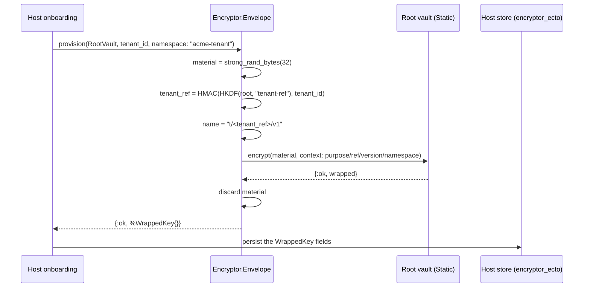
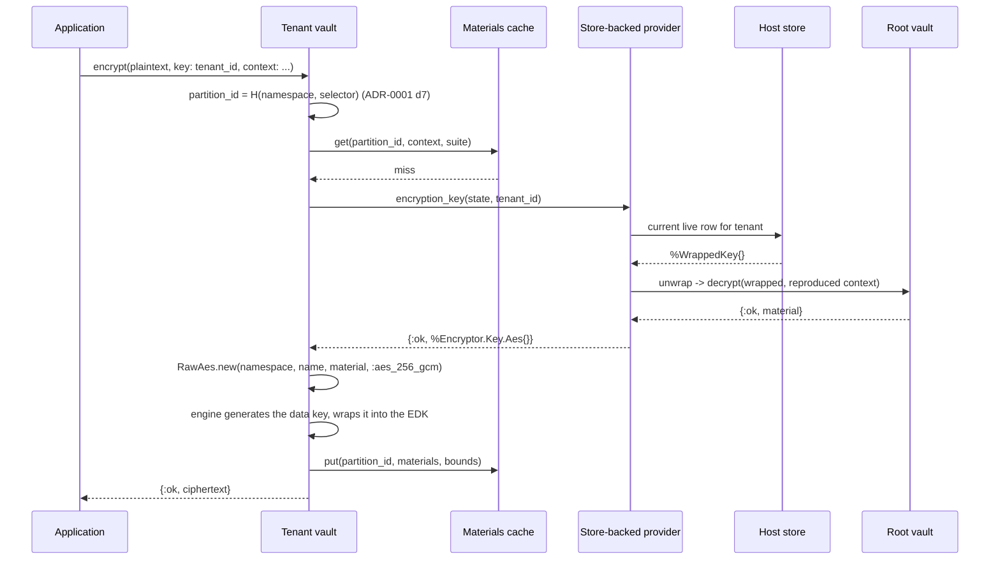

# ADR-0003: A tenant key is a random key wrapped into an ordinary message, and the host stores the wrapping

Status: accepted (2026-08-27, amended at acceptance: the `tenant_ref/2`
signature takes the reference subkey rather than a root vault, per
ADR-0005 decision 5 and its open question 1)

## Context

ADR-0001 fixed the vault and ADR-0002 fixed the provider contract. Both stop
at the same place: a provider hands the vault an `%Encryptor.Key.Aes{}` and
the vault builds a keyring from it, but nothing says where a tenant's key
material comes from, what protects it at rest, or what a host has to persist
for a decrypt to still work in three years. That is this record.

The shape being described is a three-level hierarchy, and naming the levels
before deciding anything about them prevents most of the confusion in this
area:

- **Level 1, the root key.** One key per deployment, supplied from the
  environment today and from a key manager later. It never encrypts
  application data. It exists to protect level 2.
- **Level 2, the tenant master key.** One key per tenant per version. It
  never encrypts application data either. It is the wrapping key the tenant
  vault's `RawAes` keyring is built from, and it is what makes one tenant's
  data cryptographically separable from another's.
- **Level 3, the data key.** One per message, generated by the engine,
  wrapped by the level 2 key into the message's own encrypted data key, and
  discarded. This package does not implement level 3 at all; the engine does,
  and has since before this package existed.

So the package's actual subject is the relationship between levels 1 and 2:
how a tenant master key comes into existence, what protects it while it sits
in a host's database, how it gets back into memory on a decrypt path, and who
can read what when one of the two levels is compromised.

**The bead's framing has one clause that does not survive contact with the
engine, and it is flagged here rather than quietly worked around.** enc-2u6
describes level 3 as "RawAes keyring per tenant or one custom keyring
resolving by tenant id". The second option does not exist in
`aws_encryption_sdk` v1.0.0. `Cmm.Default` dispatches on the keyring's struct
type over a closed set of `RawAes`, `RawRsa`, `Multi`, and the four AWS KMS
keyrings, returning `{:error, {:unsupported_keyring_type, module}}` for
anything else (`lib/aws_encryption_sdk/cmm/default.ex`), and `Client.encrypt/3`
does the same for CMMs. ADR-0001 recorded this as decision-shaping context and
ADR-0002 built its whole descriptor indirection on top of it. This record
therefore takes the first option, which is not a fallback: per-tenant
separation is a per-tenant `RawAes` keyring built per call from a resolved
descriptor, plus the per-tenant cache partition id of ADR-0001 decision 7. No
sibling record is amended, and the tensions this creates are numbered open
questions rather than edits to accepted text.

Four further forces bind what follows.

**Storing a wrapped key and deriving a key are different security products,
and the difference is crypto-shredding.** ADR-0002's worked example derives a
tenant key as `:crypto.mac(:hmac, :sha256, root_key, "#{tenant_id}/#{version}")`
and labels itself "illustrative only: the real wrapping structure is enc-2u6's
decision". Taking that label seriously: a derived key cannot be destroyed.
Deleting the row that records a derived key deletes a memo, not a secret,
because anyone holding the root key can recompute the key material from the
tenant id and the version forever. Every offboarding, every erasure request,
every "shred this tenant" runbook step becomes an assertion about deleted
ciphertext rather than about destroyed keys. Storing an independently random
key wrapped under the root gives the opposite property: destroy the wrapping
and the plaintext is unrecoverable even by the holder of the root key. That
property is the reason this record exists, and it is worth the storage.

**The wrap does not need new cryptography, and reaching for some would be a
regression.** The obvious temptation is to specify a bespoke wrapped-key
format: a version byte, a nonce, an AES-GCM ciphertext, a tag, some framing.
This package would then own a hand-rolled format, its parser, its versioning,
and its migration story, sitting one layer below a dependency chosen
specifically to avoid hand-rolled formats. The engine already produces a
self-describing, key-committed, context-bound message; a wrapped tenant key
is just a small plaintext. Wrapping it with this package's own vault means the
wrapped-key blob is an ordinary `Encryptor` ciphertext, and every property
ADR-0001 bought - commitment policy, EDK limits, context binding, the error
vocabulary, `rekey/2` - applies to it for free.

**The unwrap sits on the hot path, and ADR-0002 already decided what may cache
it.** Resolving a tenant key means reading a row and decrypting a blob. That
is a database round trip plus an engine decrypt on the way to every encrypted
column read, which would be intolerable per call. It is not per call: ADR-0001
decisions 6 and 7 put a bounded materials cache in front of resolution,
partitioned per tenant, so the provider is consulted once per tenant per
`max_age` rather than once per operation. ADR-0002 decision 2 then forbids a
provider from adding a second unbounded cache. Those two decisions are load
bearing here, and this record's performance story is entirely "the materials
cache is the tenant-key cache". No new caching layer is introduced.

This record owns the key hierarchy, the wrapped-key blob format, the
provisioning and unwrap flows, and the trust boundary statement. It does not
own the storage schema or the migration (`encryptor_ecto`), the encryption
context vocabulary (enc-cvw), or the rotation and shredding procedures
(enc-53a). It gives all three something concrete to attach to.

## Decision

**1. A tenant master key is 32 random bytes from the CSPRNG, generated once,
never derived.** Provisioning calls `:crypto.strong_rand_bytes(32)`. The key
is not a function of the tenant id, the version, the root key, or anything
else, which means:

- Destroying every copy of the wrapping destroys the key. Crypto-shredding is
  a delete, and it is honest.
- Root key compromise alone does not yield tenant keys. It yields the ability
  to unwrap the wrappings an attacker also has to steal.
- Two tenants' keys are independent, so a bug in reference derivation or in
  version accounting cannot cause two tenants to collide on the same material.

The size is fixed at 256 bits because ADR-0001's suites both use AES-256-GCM
for the data key and there is no reason for the wrapping key to be the weaker
link. `bits` in the descriptor is therefore always `256` on this path, even
though `%Encryptor.Key.Aes{}` permits 128 and 192 for other providers.

**2. The wrapping is an ordinary `Encryptor` message produced by a root
vault.** A host runs two vaults, which is exactly the shape ADR-0001
decision 3 anticipated:

```elixir
defmodule MyApp.RootVault do        # single-key, wraps tenant keys
  use Encryptor.Vault, otp_app: :my_app
end

defmodule MyApp.TenantVault do      # per-tenant, encrypts application data
  use Encryptor.Vault, otp_app: :my_app
end
```

Provisioning encrypts the 32 bytes with `MyApp.RootVault.encrypt/2`. Unwrapping
decrypts them with `MyApp.RootVault.decrypt/2`. The stored blob is a complete
engine message, and this package defines no wire format of its own beyond
which encryption context goes into it (decision 4).

Three consequences make this the right trade rather than merely a tidy one:

- **The root can move to a key manager without a format change.** Swapping the
  root vault's provider from `Encryptor.Provider.Static` to
  `Encryptor.Provider.Kms` changes which keyring wraps the data key inside the
  blob. The blob stays an engine message, the stored column stays a `binary`,
  and the migration is a rewrap pass, not a schema change. The bead's "env
  supplied; KMS later" is thereby a provider swap.
- **Root rotation is `rekey/2` and nothing else.** ADR-0001 decision 4 defined
  `rekey/2` as decrypt-under-the-message's-own-keys, re-encrypt-under-current,
  context preserved byte for byte. Applied to a wrapped tenant key that is
  precisely a root rotation, and it never touches a single row of application
  data. This is the concrete caller ADR-0001 open question 5 was looking for.
- **The blob is key-committed and context-bound** because the root vault's
  configuration says so, and a host cannot weaken that per call, because
  ADR-0001 decision 4 made suite and commitment policy configuration only.

The root vault is configured `cache: false`. Provisioning is rare and unwraps
are already collapsed by the tenant vault's cache; a second cache here would
hold the root's own data keys with no measurable benefit and a real cost in
what sits in memory.

**3. The provisioning result is an `%Encryptor.Envelope.WrappedKey{}`, and the
plaintext key never appears in a return value.** `provision/3` generates the
material, wraps it, and returns the wrapping plus the identity fields needed
to rebuild the descriptor later. The plaintext exists inside one function body
and is not returned, logged, or included in any struct:

```elixir
%Encryptor.Envelope.WrappedKey{
  tenant_ref: String.t(),
  version: pos_integer(),
  namespace: String.t(),
  name: String.t(),
  bits: 256,
  wrapped: binary()
}
```

A caller that wants the plaintext material calls `unwrap/2`, which returns an
`%Encryptor.Key.Aes{}` descriptor, which is the type ADR-0002 decision 3 says
a provider returns. There is no function in this package that returns a bare
tenant master key as a binary. The narrow surface is deliberate: the one thing
a host is likely to do wrong with this API is persist the plaintext key beside
the wrapping "for convenience", and an API that never hands it over makes that
require obvious effort.

**4. The wrapping's encryption context is package-owned, and it binds the blob
to one tenant and one version.** `provision/3` sets, and `unwrap/2` reproduces
and requires:

```elixir
%{
  "encryptor-purpose" => "tenant-key-wrap",
  "encryptor-tenant-ref" => tenant_ref,
  "encryptor-key-version" => Integer.to_string(version),
  "encryptor-key-namespace" => namespace
}
```

The context is not a host option on this path. Passing `:encryption_context`
to `provision/3` is `{:error, {:reserved_context_key, key}}`, reusing
ADR-0001's existing reason rather than inventing one. The host's own static
context from the root vault's configuration still merges underneath, because
that is ADR-0001 decision 4's behaviour and there is no reason to special-case
it.

What this buys is the confused-deputy defence. The engine authenticates the
context and fails a decrypt whose reproduced context does not match. So a blob
copied from tenant A's row into tenant B's row does not decrypt; a blob copied
from version 2 to version 3 does not decrypt; a blob from some other part of
the application that happens to be an `Encryptor` message does not decrypt as
a tenant key. Without the binding, all three are silent successes that yield
the wrong key, and the wrong key surfaces later as `:decrypt_failed` on
application data, which is the worst possible place to first learn about it.

The context also makes the blob self-describing: the tenant reference, the
version, and the namespace are recoverable from the blob itself, so the
persisted columns are a denormalized index over the authenticated truth rather
than the only copy of it. The `encryptor-` prefix is this package's, chosen to
sit clear of the engine's reserved `aws-crypto-` prefix that ADR-0001
decision 4 refuses. Whether these exact key names are the canonical vocabulary
is enc-cvw's to ratify; this record commits only to the binding being
package-owned and to those four facts being in it.

**5. `tenant_ref` is a keyed derivation of the tenant identifier, not a hash
of it.** ADR-0002 decision 4 established why the raw identifier must not
appear in `name`: the name travels in the clear in every message header, so a
raw tenant id is published in every row. Its worked example derived a
reference with a plain `:crypto.hash(:sha256, tenant_id)`. This record
tightens that, and the tightening is a delta worth stating: an unkeyed hash of
a low-entropy identifier is reversible by anyone who can guess the identifier
space, and tenant identifiers are frequently small integers or short slugs.
Anyone holding one ciphertext can then confirm which tenant wrote it by
hashing candidates.

The derivation is therefore keyed, under a subkey of the root:

```
ref_key   = HKDF-Expand(root_key, info: "encryptor/v1/tenant-ref", 32)
tenant_ref = Base.url_encode64(binary_part(HMAC-SHA256(ref_key, tenant_id), 0, 16), padding: false)
```

and `name` follows ADR-0002's recommended grammar, `"t/<tenant_ref>/v<n>"`.
Two properties matter. The reference is stable, so the same tenant always
resolves to the same reference and the row can be found. And it is unguessable
without the root key, so a header discloses that two ciphertexts belong to the
same tenant without disclosing which tenant that is.

The cost is that the tenant reference now depends on the root key, so a root
rotation that changes the root key material would change every reference.
Decision 6 handles that by giving the reference subkey its own lifecycle, and
open question 3 records the part that is genuinely enc-53a's.

`namespace` is one value per tenant vault, configured, defaulting to
`"encryptor-tenant"`. It must not begin with `aws-kms`, which ADR-0002
decision 3 already validates.

**6. The root has two subkeys with different lifetimes, and only one of them
wraps anything.** The root key material as supplied by the environment is
never used directly. Two labels are expanded from it:

| Label | Use | Rotates with |
|---|---|---|
| `"encryptor/v1/root-wrap"` | the root vault's `Static` provider material | a rewrap pass over every wrapped key |
| `"encryptor/v1/tenant-ref"` | the reference derivation in decision 5 | a re-index pass over every stored row |

Separating them means a routine root rotation - the one an operator actually
wants to run - can replace the wrapping subkey while leaving every stored
`tenant_ref` valid, because `rekey/2` rewrites the blob without touching the
row's identity columns. Deriving both from one root key material and rotating
that material is the expensive case, and it is expensive in a way that would
otherwise be discovered halfway through the first rotation.

The label namespace is explicitly reserved beyond these two. Any future
purpose-separated key derived from the root or from a tenant master key takes
a new `"encryptor/v<n>/<purpose>"` label and never reuses an existing one.
Decision 7 says what that reservation is for.

**7. The tenant master key is a wrapping key first, and a derivation root only
under an explicit label.** Downstream work in `encryptor_ecto` on blind
indexes needs per-tenant index keys, and an index key must not be the tenant's
wrapping key: a component that can compute searchable index values would then
also be able to decrypt every column. This record does not decide the blind
index, but it does decide the room it gets, because retrofitting purpose
separation after keys are in production is a rewrap of everything.

The reservation:

- The tenant master key is used directly as `RawAes` material for the
  encryption path, and that use is unlabelled because it predates and defines
  the key. Changing it would invalidate stored ciphertext.
- Any other use of a tenant master key derives a subkey by
  `HKDF-Expand(tenant_master_key, info: "encryptor/v1/<purpose>", 32)` with a
  purpose label that is not `"root-wrap"` or `"tenant-ref"`. An index-key tree
  would take, for example, `"encryptor/v1/blind-index"`.
- A derived subkey is never stored. It is recomputed from the tenant master
  key on demand, so it inherits the master key's shred semantics exactly:
  destroying the wrapping destroys the index keys too.

What this reservation does **not** provide is capability separation. A
component that can derive index keys under this scheme necessarily holds the
tenant master key, and therefore can also decrypt. A genuine search-only
capability - an indexer that can compute index values but cannot read columns
- requires an independently random index key with its own wrapping, stored in
its own column, so that the two capabilities can be handed out separately.
That is a second wrapped key per tenant, not a derivation, and it is a real
design with a real cost. This record deliberately leaves the door open for it
(the `WrappedKey` struct is per-purpose-agnostic and a second row is a second
row) without paying for it now. Open question 4 assigns the decision.

**8. Provisioning is explicit, and resolution never creates keys.** A tenant
key comes into existence exactly when a caller runs `provision/3`, which is a
tenant-creation step in the host's onboarding path or a rotation step in
enc-53a's runbook. `encryption_key/2` and `decryption_keys/2` never
provision. This restates ADR-0002 decision 2's stability rule, but it is worth
its own line here because the envelope is where the temptation lives: a
provider that lazily provisions on first use looks convenient and means that
a typo in a tenant identifier silently mints a key, that a race between two
requests can mint two keys for one tenant, and that the first encrypt after a
deploy does a write on the read path. An unknown selector is
`{:error, {:unknown_key, selector}}`, full stop.

**9. What this package never sees is the storage.** The package produces and
consumes `WrappedKey` structs. It does not define a table, a migration, a
repo, a primary key, an index, or a transaction. `encryptor_ecto` owns all of
that, and ADR-0002 decision 5 already placed the Ecto-backed provider there
for this reason.

What this record does fix is the minimum a store must be able to give back,
because a store missing any of it cannot reconstruct a descriptor:

- the wrapping (`wrapped`), which is the only field that is secret-adjacent,
- the tenant reference and the version, which reproduce the encryption
  context and therefore gate the unwrap,
- the namespace and the derived name, which the EDK matches on
  (`RawAes.unwrap_key/3` compares `key_provider_id` to the keyring's namespace
  and the deserialized provider info's `key_name` to the keyring's name),
- enough ordering information to return live versions newest first, per
  ADR-0002 decision 4.

Everything else - soft-delete columns, shred timestamps, audit trails, which
of several stores a tenant lives in - is the host's and enc-53a's. In
particular this record does not decide what "live" means; it decides that the
provider asks the store and the store answers.

**10. The blast radii, stated once, plainly.** This is the trust boundary
statement the bead asks for, and it is the reason the design is shaped the way
it is.

| Attacker holds | Can read |
|---|---|
| Application ciphertext only | nothing |
| Ciphertext + the wrapped-key store | nothing |
| Ciphertext + the root key | nothing |
| Ciphertext + the wrapped-key store + the root key | everything, all tenants |
| Ciphertext + one tenant's unwrapped master key | that tenant, all versions that key covers |
| A running application process | everything it can currently resolve |

Four things follow, and each is a limitation as much as a property:

- **The two-factor property is real but conditional.** Separating the root key
  (environment, secrets manager) from the wrapped keys (database) means a
  database compromise alone - the overwhelmingly common one, from a backup, a
  read replica, a dump, an SQL injection - yields nothing. This is the
  design's main return.
- **The running process is not protected against, at all.** A process that can
  encrypt for a tenant necessarily holds that tenant's master key in memory,
  and one that can provision holds the root. Any attacker with code execution
  or memory read in the application defeats the hierarchy entirely. Moving the
  root to KMS narrows this - the root key material stops being in BEAM memory
  - but the unwrapped tenant keys still are, and ADR-0002's first consequence
  already said the same thing about material-source providers generally.
- **Tenant compromise is bounded by version, not by time.** One master key
  covers every message written while it was current. A tenant compromised at
  version 3 exposes exactly the data encrypted under version 3, which is why
  rotation cadence is a real security parameter and not hygiene theatre.
- **Shredding is only as good as the copies.** Deleting a wrapping makes the
  data unrecoverable in the primary store and does nothing about database
  backups, replicas, or a wrapping someone exported. The mechanism is sound;
  the operational discipline around it is enc-53a's, and it is the harder
  half.

## Consequences

**Provisioning becomes a step a host cannot forget.** Every tenant must be
provisioned before its first encrypt, so tenant creation now has a step that
can fail, and a host that adds a tenant by inserting a row directly - a
seed script, a support tool, a data migration - produces a tenant whose first
encrypt returns `{:unknown_key, id}`. That is the correct failure and it is
loud, but it is new surface area in the host's onboarding path, and the
package should ship the provisioning function documented as an onboarding
step rather than as an API detail.

**Every tenant key resolution is a database read plus an engine decrypt.** The
materials cache collapses this to once per tenant per `max_age`, which is the
whole reason ADR-0001 made `max_age` a required setting with no default. Two
second-order effects follow. A host with many tenants and a short `max_age`
does proportionally more root-vault decrypts, so `max_age` is now a knob with
a database load story attached, not just a key-lifetime story. And ADR-0001's
cache recycler empties every partition at once, so a recycle is followed by a
burst of store reads across all active tenants rather than one - a thundering
herd shaped by `recycle_after`, on top of the p99 spike ADR-0001 already
recorded.

**The wrapped-key store becomes availability-critical.** Before this record,
an unreachable key store was a provider concern. Now it is on the path of
every cold-cache read of every encrypted column, so the store's availability
is the application's availability for anything encrypted. ADR-0002 decision 6
already gave this its own error, `{:key_unavailable, selector}`, distinct from
`:decrypt_failed`; this record is what makes that distinction earn its keep,
since the difference between "the key store is down" and "this data is
corrupt" is now the difference between a five-minute outage and a data-loss
incident review.

**Root rotation is cheap and reference rotation is not.** Decision 6's split
makes the common case a `rekey/2` pass over one row per tenant per live
version - thousands of rows, not millions, and no application data touched.
Rotating the reference subkey instead means recomputing `tenant_ref` for every
tenant, rewriting every stored name, and leaving every already-written message
header carrying the old reference, which no longer resolves. In practice the
reference subkey is not rotatable after the first message is written; it is
effectively permanent, and decision 6 exists to make sure that permanence
attaches to the cheap thing rather than to the whole root.

**A tenant with many live versions costs one store read for all of them.**
`decryption_keys/2` returns every live version, so the provider reads the
tenant's rows once and unwraps each. ADR-0002's consequence about
sixty-candidate walks compounds here: sixty versions is sixty engine decrypts
of small blobs on a cold cache, not sixty comparisons. Still small in absolute
terms, still bounded by the same cache, but it argues for pruning being
count-based rather than purely age-based when enc-53a decides.

**This package now depends on itself in a specific way.** The root vault used
to wrap tenant keys is an `Encryptor.Vault`, so `Encryptor.Envelope` sits
above the vault rather than beside it, and a circular-looking arrangement
(a vault's provider resolving keys that were wrapped by a vault) is real but
acyclic: the root vault's provider is `Static` and resolves nothing from the
store. That constraint is worth enforcing in documentation - a root vault
configured with a store-backed provider would be a genuine cycle, and it would
deadlock or recurse rather than fail cleanly.

**The blob format is the engine's, so the engine's version story is ours.**
A future engine major version that changes the message format changes the
format of every stored wrapped key. This is the same exposure the application
ciphertext already has, so it adds no new risk category, but it does mean a
format migration would have to walk two populations rather than one - and the
key population must be migrated first.

## The contract as typespecs

```elixir
defmodule Encryptor.Envelope.WrappedKey do
  @type t :: %__MODULE__{
          tenant_ref: String.t(),
          version: pos_integer(),
          namespace: String.t(),
          name: String.t(),
          bits: 256,
          wrapped: binary()
        }

  @enforce_keys [:tenant_ref, :version, :namespace, :name, :bits, :wrapped]
  defstruct @enforce_keys
end
```

```elixir
defmodule Encryptor.Envelope do
  @type root_vault :: module()
  @type selector :: Encryptor.Vault.selector()

  @type opts :: [
          namespace: String.t(),
          version: pos_integer()
        ]

  @doc "Mint a tenant master key and wrap it under the root vault."
  @spec provision(root_vault(), selector(), opts()) ::
          {:ok, Encryptor.Envelope.WrappedKey.t()} | {:error, Encryptor.Error.t()}

  @doc "Unwrap a stored wrapping into the descriptor a provider returns."
  @spec unwrap(root_vault(), Encryptor.Envelope.WrappedKey.t()) ::
          {:ok, Encryptor.Key.Aes.t()} | {:error, Encryptor.Error.t()}

  @doc "Re-wrap under the root vault's current materials. Root rotation."
  @spec rewrap(root_vault(), Encryptor.Envelope.WrappedKey.t()) ::
          {:ok, Encryptor.Envelope.WrappedKey.t()} | {:error, Encryptor.Error.t()}

  @doc """
  The keyed, stable, public reference for a tenant identifier.

  Amended at acceptance (2026-08-27): takes the reference subkey, not a root
  vault. A root vault holds only the wrapping subkey as its provider
  material, and after ADR-0005 decision 5 splits the roots the reference
  derives from the pinned reference root, which no vault holds. The
  reference subkey is a configured input (see ADR-0004's amended decision 4
  for where it lives and the start-time known-answer check on it).
  """
  @spec tenant_ref(reference_subkey :: binary(), selector()) ::
          {:ok, String.t()} | {:error, Encryptor.Error.t()}

  @doc "Expand one of decision 6's labelled subkeys from the supplied root key."
  @spec root_subkey(root_key :: binary(), label :: String.t()) :: binary()

  @doc "Derive a purpose-separated subkey from a tenant master key (decision 7)."
  @spec subkey(Encryptor.Key.Aes.t(), purpose :: String.t()) :: binary()
end
```

No new terms are added to `Encryptor.Error.reason/0`. Everything this module
can fail with is already in the vocabulary ADR-0001 decision 10 fixed and
ADR-0002 decision 6 extended: `{:unknown_key, selector}` for a tenant with no
live version, `{:key_unavailable, selector}` for a store that could not
answer, `:decrypt_failed` for a wrapping that does not unwrap under the
reproduced context, `{:reserved_context_key, key}` for a caller trying to
supply context to `provision/3`, and `{:invalid_key_descriptor, detail}` for
a stored row whose fields cannot form a descriptor. That the envelope needs no
new reasons is a check on the design: a layer that required its own error
vocabulary would be a layer the other two records had not actually anticipated.

## The flows

Provisioning, once per tenant per version:



Resolution on a cold cache, once per tenant per `max_age`:



The decrypt path differs in exactly two places: the provider calls
`decryption_keys/2` and returns every live version newest first, and the vault
builds `Multi.new(generator: nil, children: [...])` rather than a bare
`RawAes`, per ADR-0002 decision 4. Everything else, including the partition id
and the cache interaction, is identical.

## Worked example: provisioning and using a tenant

```elixir
# config/config.exs - structure only, never key material
config :my_app, MyApp.RootVault,
  algorithm_suite_id: 0x0478,
  cache: false

config :my_app, MyApp.TenantVault,
  algorithm_suite_id: 0x0478,
  max_encrypted_data_keys: 2,
  cache: [max_age: 300]
```

```elixir
defmodule MyApp.RootVault do
  use Encryptor.Vault, otp_app: :my_app

  @impl true
  def init(config) do
    root = Base.decode64!(System.fetch_env!("MY_APP_ROOT_KEY"))

    {:ok,
     Keyword.put(config, :provider,
       {Encryptor.Provider.Static,
        key: Encryptor.Envelope.root_subkey(root, "root-wrap"),
        namespace: "encryptor-root",
        name: "r/v1"})}
  end
end
```

Onboarding a tenant:

```elixir
{:ok, wrapped} =
  Encryptor.Envelope.provision(MyApp.RootVault, tenant.id, namespace: "acme-tenant")

{:ok, _row} = MyApp.TenantKeys.insert(wrapped)
```

Using it, with no visible difference from ADR-0001's worked example:

```elixir
{:ok, ct} =
  MyApp.TenantVault.encrypt(record.notes,
    key: tenant.id,
    encryption_context: %{"tenant_id" => tenant.id, "table" => "records", "column" => "notes"}
  )
```

Rotating the root, touching no application data:

```elixir
for row <- MyApp.TenantKeys.all_live() do
  {:ok, rewrapped} = Encryptor.Envelope.rewrap(MyApp.RootVault, row)
  MyApp.TenantKeys.update_wrapping(row, rewrapped)
end
```

Shredding a tenant:

```elixir
MyApp.TenantKeys.delete_all_for(tenant.id)
# Every ciphertext written for that tenant is now permanently unreadable,
# including by the holder of the root key. That is the point of decision 1.
```

What these are chosen to demonstrate:

- **The application-facing call is unchanged.** Everything in this record is
  below `:key`, which is still the whole of per-tenant routing. A host that
  starts on `Encryptor.Provider.Function` and moves to wrapped storage changes
  its provider and its onboarding, not its call sites.
- **The root vault holds a subkey, not the root.** `root_subkey/2` is
  decision 6's label expansion, written out at the one place a host sees it.
- **`cache: false` on the root vault** is decision 2's configuration, visible
  rather than defaulted, since ADR-0001 requires `max_age` whenever caching is
  on and a host that copies the tenant vault's block would get a second cache
  it does not want.
- **The shred is a delete with a comment**, because the strength of the claim
  in that comment is the entire justification for storing a random key instead
  of deriving one.

## Open questions

Recorded rather than guessed. Each names who should settle it.

1. **Whether `provision/3` belongs in this package or in `encryptor_ecto`.**
   It generates, wraps, and returns a struct, touching no storage, so it fits
   here. But every real caller immediately writes a row, and a `provision/3`
   that cannot enforce uniqueness of `{tenant_ref, version}` leaves the race
   decision 8 refuses to create lazily still possible for two concurrent
   onboarding requests. The transaction that closes that race is in
   `encryptor_ecto`. Settle when that adapter is built; the split may want to
   be `provision/3` here and `provision!/2` there.

2. **Whether the tenant reference derivation should be keyed at all.**
   Decision 5 keys it, which departs from ADR-0002's illustrative unkeyed
   hash. Keying costs a hard dependency of the reference on the root and makes
   the reference subkey effectively unrotatable (consequence four). A host
   that considers tenant identity non-sensitive would rather have a reference
   it can recompute without the root, for support tooling and for
   reconciliation. Settle with enc-cvw, which is deciding what identifies a
   tenant anyway, and which inherits ADR-0002 open question 5 on the same
   subject.

   *Resolved at acceptance (2026-08-27): the derivation stays keyed, and
   ADR-0004's amended decision 4 puts the derived `tenant_ref` - not the raw
   identifier - into the application-data context, so the keying now
   protects application-row attribution as well as the key store and the
   key names. One correction to consequence four's framing: the reference
   is published in every application message header via the EDK key name,
   so the reference subkey is effectively permanent from the first
   application message, not merely the first wrapped-key blob.*

3. **How a root rotation that changes the root key material is staged.**
   Decision 6 makes the wrapping subkey rotatable via `rekey/2`, but a rewrap
   pass is not atomic: mid-pass, some rows are under the old subkey and some
   under the new, and a root vault holding only the new one cannot read the
   old. The engine's `Multi` with the old and new root as children solves it
   the same way ADR-0002 decision 4 solves tenant rotation, but that requires
   the root vault's provider to return a candidate list, which `Static` does
   not. enc-53a owns the runbook; it may need a small `Static` extension.

4. **Whether a search-only capability is wanted, and therefore whether index
   keys are derived or independently wrapped.** Decision 7 reserves the label
   space for derived subkeys, which is cheap and inherits shred semantics but
   grants no capability separation: deriving an index key requires the master
   key, which grants decrypt. An independently random, independently wrapped
   index key per tenant is the only shape that lets an indexing component be
   given search without read. It doubles the key rows and adds a second
   provisioning step. `encryptor_ecto`'s blind-index record owns the decision;
   this record's job was to leave both doors open, and it should be re-read
   before that one is accepted.

   *Resolved at acceptance (2026-08-27): derived subkeys for now, door held
   open. Index keys derive under `"encryptor/v1/blind-index"` per decision 7;
   the search-only capability claim in the blind-index record is softened
   accordingly, and independently wrapped index keys remain the recorded
   upgrade path if a search-only consumer materializes.*

5. **Whether one tenant master key per tenant is the right granularity.**
   Everything here assumes one key covers all of a tenant's data. A host might
   want per-purpose keys within a tenant - one for records, one for messages -
   so that a compromise or a shred is narrower than a whole tenant. The
   selector is opaque per ADR-0001, so `{tenant_id, :records}` already works
   mechanically without any change here. Whether the package should bless that
   with a documented shape, or leave it to hosts, is worth deciding before the
   first host invents its own convention.

6. **Whether `unwrap/2` should verify the descriptor against the row.** The
   context binding in decision 4 already guarantees the blob belongs to the
   claimed tenant and version, but the `name` and `namespace` columns are
   denormalized and could drift from the context inside the blob. A
   cross-check on unwrap would catch a corrupted or hand-edited row at
   resolution time rather than as an EDK mismatch later. It is one comparison;
   the reason to hesitate is that it makes the row's columns authoritative in
   a way decision 4 explicitly said they are not.

7. **The 32-byte tenant key and the 0x0478 suite are stated, not measured.**
   Both are conservative and consistent with the sibling records, and neither
   is derived from a benchmark or a threat model with numbers in it. They
   should be re-examined once there is a real workload, alongside ADR-0001
   open question 2's cache bounds, rather than being treated as settled by
   repetition.
