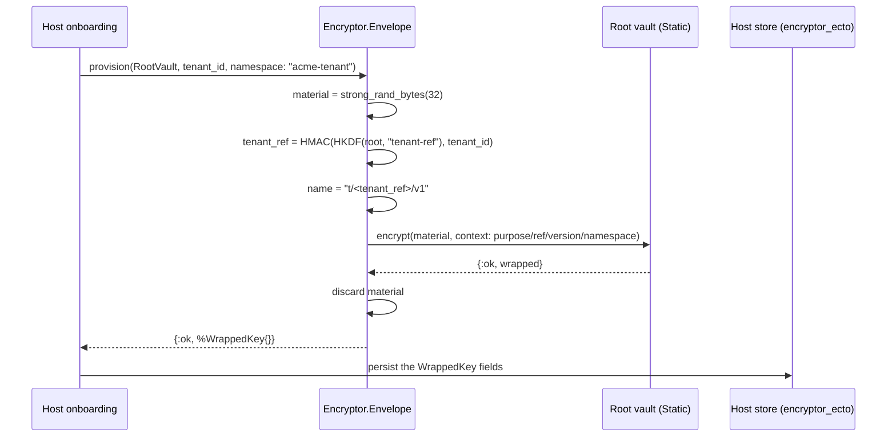
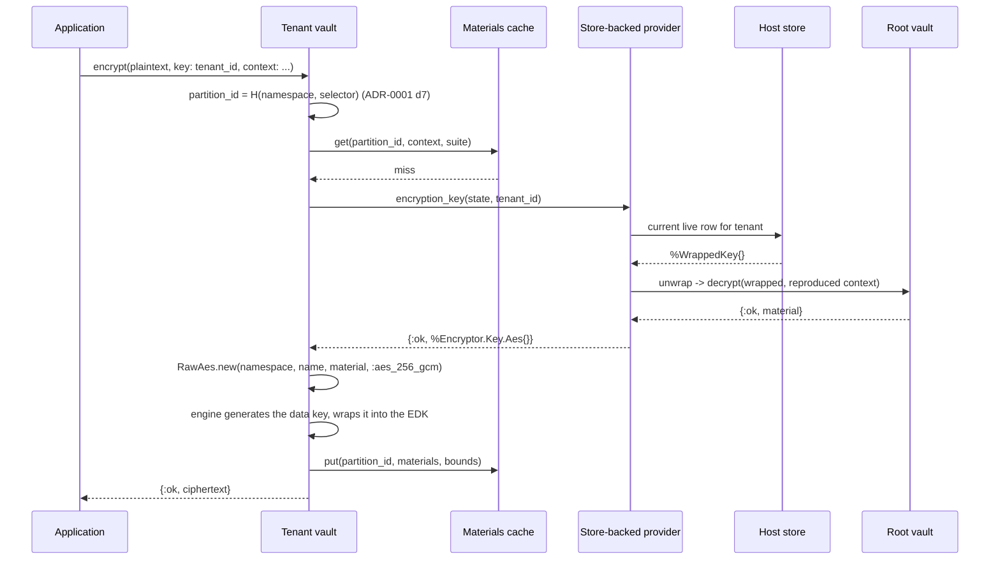

# ADR-0003: A tenant key is a random key wrapped into an ordinary message, and the host stores the wrapping

Status: accepted (2026-08-27, amended at acceptance: the `tenant_ref/2`
signature takes the reference subkey rather than a root vault, per
ADR-0005 decision 5 and its open question 1)

**Amendment A (2026-08-28) is accepted (2026-09-13).** It is appended at the
end of this record, it is additive, and it changes none of decisions 1 to 9
below.

**Amendment B (2026-09-12) is accepted (2026-09-13), together with its Note.** It is
appended after Amendment A, it is additive, and it changes none of decisions 1
to 9 below nor any of Amendment A decisions A1 to A7.

## Context

ADR-0001 fixed the vault and ADR-0002 fixed the provider contract. Both stop
at the same place: a provider hands the vault an `%Encryptor.Key.Aes{}` and
the vault builds a keyring from it, but nothing says where a tenant's key
material comes from, what protects it at rest, or what a host has to persist
for a decrypt to still work in three years. That is this record.

The shape being described is a three-level hierarchy, and naming the levels
before deciding anything about them prevents most of the confusion in this
area:

- **Level 1, the root key.** One key per deployment, supplied from the
  environment today and from a key manager later. It never encrypts
  application data. It exists to protect level 2.
- **Level 2, the tenant master key.** One key per tenant per version. It
  never encrypts application data either. It is the wrapping key the tenant
  vault's `RawAes` keyring is built from, and it is what makes one tenant's
  data cryptographically separable from another's.
- **Level 3, the data key.** One per message, generated by the engine,
  wrapped by the level 2 key into the message's own encrypted data key, and
  discarded. This package does not implement level 3 at all; the engine does,
  and has since before this package existed.

So the package's actual subject is the relationship between levels 1 and 2:
how a tenant master key comes into existence, what protects it while it sits
in a host's database, how it gets back into memory on a decrypt path, and who
can read what when one of the two levels is compromised.

**The bead's framing has one clause that does not survive contact with the
engine, and it is flagged here rather than quietly worked around.** enc-2u6
describes level 3 as "RawAes keyring per tenant or one custom keyring
resolving by tenant id". The second option does not exist in
`aws_encryption_sdk` v1.0.0. `Cmm.Default` dispatches on the keyring's struct
type over a closed set of `RawAes`, `RawRsa`, `Multi`, and the four AWS KMS
keyrings, returning `{:error, {:unsupported_keyring_type, module}}` for
anything else (`lib/aws_encryption_sdk/cmm/default.ex`), and `Client.encrypt/3`
does the same for CMMs. ADR-0001 recorded this as decision-shaping context and
ADR-0002 built its whole descriptor indirection on top of it. This record
therefore takes the first option, which is not a fallback: per-tenant
separation is a per-tenant `RawAes` keyring built per call from a resolved
descriptor, plus the per-tenant cache partition id of ADR-0001 decision 7. No
sibling record is amended, and the tensions this creates are numbered open
questions rather than edits to accepted text.

Four further forces bind what follows.

**Storing a wrapped key and deriving a key are different security products,
and the difference is crypto-shredding.** ADR-0002's worked example derives a
tenant key as `:crypto.mac(:hmac, :sha256, root_key, "#{tenant_id}/#{version}")`
and labels itself "illustrative only: the real wrapping structure is enc-2u6's
decision". Taking that label seriously: a derived key cannot be destroyed.
Deleting the row that records a derived key deletes a memo, not a secret,
because anyone holding the root key can recompute the key material from the
tenant id and the version forever. Every offboarding, every erasure request,
every "shred this tenant" runbook step becomes an assertion about deleted
ciphertext rather than about destroyed keys. Storing an independently random
key wrapped under the root gives the opposite property: destroy the wrapping
and the plaintext is unrecoverable even by the holder of the root key. That
property is the reason this record exists, and it is worth the storage.

**The wrap does not need new cryptography, and reaching for some would be a
regression.** The obvious temptation is to specify a bespoke wrapped-key
format: a version byte, a nonce, an AES-GCM ciphertext, a tag, some framing.
This package would then own a hand-rolled format, its parser, its versioning,
and its migration story, sitting one layer below a dependency chosen
specifically to avoid hand-rolled formats. The engine already produces a
self-describing, key-committed, context-bound message; a wrapped tenant key
is just a small plaintext. Wrapping it with this package's own vault means the
wrapped-key blob is an ordinary `Encryptor` ciphertext, and every property
ADR-0001 bought - commitment policy, EDK limits, context binding, the error
vocabulary, `rekey/2` - applies to it for free.

**The unwrap sits on the hot path, and ADR-0002 already decided what may cache
it.** Resolving a tenant key means reading a row and decrypting a blob. That
is a database round trip plus an engine decrypt on the way to every encrypted
column read, which would be intolerable per call. It is not per call: ADR-0001
decisions 6 and 7 put a bounded materials cache in front of resolution,
partitioned per tenant, so the provider is consulted once per tenant per
`max_age` rather than once per operation. ADR-0002 decision 2 then forbids a
provider from adding a second unbounded cache. Those two decisions are load
bearing here, and this record's performance story is entirely "the materials
cache is the tenant-key cache". No new caching layer is introduced.

This record owns the key hierarchy, the wrapped-key blob format, the
provisioning and unwrap flows, and the trust boundary statement. It does not
own the storage schema or the migration (`encryptor_ecto`), the encryption
context vocabulary (enc-cvw), or the rotation and shredding procedures
(enc-53a). It gives all three something concrete to attach to.

## Decision

**1. A tenant master key is 32 random bytes from the CSPRNG, generated once,
never derived.** Provisioning calls `:crypto.strong_rand_bytes(32)`. The key
is not a function of the tenant id, the version, the root key, or anything
else, which means:

- Destroying every copy of the wrapping destroys the key. Crypto-shredding is
  a delete, and it is honest.
- Root key compromise alone does not yield tenant keys. It yields the ability
  to unwrap the wrappings an attacker also has to steal.
- Two tenants' keys are independent, so a bug in reference derivation or in
  version accounting cannot cause two tenants to collide on the same material.

The size is fixed at 256 bits because ADR-0001's suites both use AES-256-GCM
for the data key and there is no reason for the wrapping key to be the weaker
link. `bits` in the descriptor is therefore always `256` on this path, even
though `%Encryptor.Key.Aes{}` permits 128 and 192 for other providers.

**2. The wrapping is an ordinary `Encryptor` message produced by a root
vault.** A host runs two vaults, which is exactly the shape ADR-0001
decision 3 anticipated:

```elixir
defmodule MyApp.RootVault do        # single-key, wraps tenant keys
  use Encryptor.Vault, otp_app: :my_app
end

defmodule MyApp.TenantVault do      # per-tenant, encrypts application data
  use Encryptor.Vault, otp_app: :my_app
end
```

Provisioning encrypts the 32 bytes with `MyApp.RootVault.encrypt/2`. Unwrapping
decrypts them with `MyApp.RootVault.decrypt/2`. The stored blob is a complete
engine message, and this package defines no wire format of its own beyond
which encryption context goes into it (decision 4).

Three consequences make this the right trade rather than merely a tidy one:

- **The root can move to a key manager without a format change.** Swapping the
  root vault's provider from `Encryptor.Provider.Static` to
  `Encryptor.Provider.Kms` changes which keyring wraps the data key inside the
  blob. The blob stays an engine message, the stored column stays a `binary`,
  and the migration is a rewrap pass, not a schema change. The bead's "env
  supplied; KMS later" is thereby a provider swap.
- **Root rotation is `rekey/2` and nothing else.** ADR-0001 decision 4 defined
  `rekey/2` as decrypt-under-the-message's-own-keys, re-encrypt-under-current,
  context preserved byte for byte. Applied to a wrapped tenant key that is
  precisely a root rotation, and it never touches a single row of application
  data. This is the concrete caller ADR-0001 open question 5 was looking for.
- **The blob is key-committed and context-bound** because the root vault's
  configuration says so, and a host cannot weaken that per call, because
  ADR-0001 decision 4 made suite and commitment policy configuration only.

The root vault is configured `cache: false`. Provisioning is rare and unwraps
are already collapsed by the tenant vault's cache; a second cache here would
hold the root's own data keys with no measurable benefit and a real cost in
what sits in memory.

**3. The provisioning result is an `%Encryptor.Envelope.WrappedKey{}`, and the
plaintext key never appears in a return value.** `provision/3` generates the
material, wraps it, and returns the wrapping plus the identity fields needed
to rebuild the descriptor later. The plaintext exists inside one function body
and is not returned, logged, or included in any struct:

```elixir
%Encryptor.Envelope.WrappedKey{
  tenant_ref: String.t(),
  version: pos_integer(),
  namespace: String.t(),
  name: String.t(),
  bits: 256,
  wrapped: binary()
}
```

A caller that wants the plaintext material calls `unwrap/2`, which returns an
`%Encryptor.Key.Aes{}` descriptor, which is the type ADR-0002 decision 3 says
a provider returns. There is no function in this package that returns a bare
tenant master key as a binary. The narrow surface is deliberate: the one thing
a host is likely to do wrong with this API is persist the plaintext key beside
the wrapping "for convenience", and an API that never hands it over makes that
require obvious effort.

**4. The wrapping's encryption context is package-owned, and it binds the blob
to one tenant and one version.** `provision/3` sets, and `unwrap/2` reproduces
and requires:

```elixir
%{
  "encryptor-purpose" => "tenant-key-wrap",
  "encryptor-tenant-ref" => tenant_ref,
  "encryptor-key-version" => Integer.to_string(version),
  "encryptor-key-namespace" => namespace
}
```

The context is not a host option on this path. Passing `:encryption_context`
to `provision/3` is `{:error, {:reserved_context_key, key}}`, reusing
ADR-0001's existing reason rather than inventing one. The host's own static
context from the root vault's configuration still merges underneath, because
that is ADR-0001 decision 4's behaviour and there is no reason to special-case
it.

What this buys is the confused-deputy defence. The engine authenticates the
context and fails a decrypt whose reproduced context does not match. So a blob
copied from tenant A's row into tenant B's row does not decrypt; a blob copied
from version 2 to version 3 does not decrypt; a blob from some other part of
the application that happens to be an `Encryptor` message does not decrypt as
a tenant key. Without the binding, all three are silent successes that yield
the wrong key, and the wrong key surfaces later as `:decrypt_failed` on
application data, which is the worst possible place to first learn about it.

The context also makes the blob self-describing: the tenant reference, the
version, and the namespace are recoverable from the blob itself, so the
persisted columns are a denormalized index over the authenticated truth rather
than the only copy of it. The `encryptor-` prefix is this package's, chosen to
sit clear of the engine's reserved `aws-crypto-` prefix that ADR-0001
decision 4 refuses. Whether these exact key names are the canonical vocabulary
is enc-cvw's to ratify; this record commits only to the binding being
package-owned and to those four facts being in it.

**5. `tenant_ref` is a keyed derivation of the tenant identifier, not a hash
of it.** ADR-0002 decision 4 established why the raw identifier must not
appear in `name`: the name travels in the clear in every message header, so a
raw tenant id is published in every row. Its worked example derived a
reference with a plain `:crypto.hash(:sha256, tenant_id)`. This record
tightens that, and the tightening is a delta worth stating: an unkeyed hash of
a low-entropy identifier is reversible by anyone who can guess the identifier
space, and tenant identifiers are frequently small integers or short slugs.
Anyone holding one ciphertext can then confirm which tenant wrote it by
hashing candidates.

The derivation is therefore keyed, under a subkey of the root:

```
ref_key   = HKDF-Expand(root_key, info: "encryptor/v1/tenant-ref", 32)
tenant_ref = Base.url_encode64(binary_part(HMAC-SHA256(ref_key, tenant_id), 0, 16), padding: false)
```

and `name` follows ADR-0002's recommended grammar, `"t/<tenant_ref>/v<n>"`.
Two properties matter. The reference is stable, so the same tenant always
resolves to the same reference and the row can be found. And it is unguessable
without the root key, so a header discloses that two ciphertexts belong to the
same tenant without disclosing which tenant that is.

The cost is that the tenant reference now depends on the root key, so a root
rotation that changes the root key material would change every reference.
Decision 6 handles that by giving the reference subkey its own lifecycle, and
open question 3 records the part that is genuinely enc-53a's.

`namespace` is one value per tenant vault, configured, defaulting to
`"encryptor-tenant"`. It must not begin with `aws-kms`, which ADR-0002
decision 3 already validates.

**6. The root has two subkeys with different lifetimes, and only one of them
wraps anything.** The root key material as supplied by the environment is
never used directly. Two labels are expanded from it:

| Label | Use | Rotates with |
|---|---|---|
| `"encryptor/v1/root-wrap"` | the root vault's `Static` provider material | a rewrap pass over every wrapped key |
| `"encryptor/v1/tenant-ref"` | the reference derivation in decision 5 | a re-index pass over every stored row |

Separating them means a routine root rotation - the one an operator actually
wants to run - can replace the wrapping subkey while leaving every stored
`tenant_ref` valid, because `rekey/2` rewrites the blob without touching the
row's identity columns. Deriving both from one root key material and rotating
that material is the expensive case, and it is expensive in a way that would
otherwise be discovered halfway through the first rotation.

The label namespace is explicitly reserved beyond these two. Any future
purpose-separated key derived from the root or from a tenant master key takes
a new `"encryptor/v<n>/<purpose>"` label and never reuses an existing one.
Decision 7 says what that reservation is for.

**7. The tenant master key is a wrapping key first, and a derivation root only
under an explicit label.** Downstream work in `encryptor_ecto` on blind
indexes needs per-tenant index keys, and an index key must not be the tenant's
wrapping key: a component that can compute searchable index values would then
also be able to decrypt every column. This record does not decide the blind
index, but it does decide the room it gets, because retrofitting purpose
separation after keys are in production is a rewrap of everything.

The reservation:

- The tenant master key is used directly as `RawAes` material for the
  encryption path, and that use is unlabelled because it predates and defines
  the key. Changing it would invalidate stored ciphertext.
- Any other use of a tenant master key derives a subkey by
  `HKDF-Expand(tenant_master_key, info: "encryptor/v1/<purpose>", 32)` with a
  purpose label that is not `"root-wrap"` or `"tenant-ref"`. An index-key tree
  would take, for example, `"encryptor/v1/blind-index"`.
- A derived subkey is never stored. It is recomputed from the tenant master
  key on demand, so it inherits the master key's shred semantics exactly:
  destroying the wrapping destroys the index keys too.

What this reservation does **not** provide is capability separation. A
component that can derive index keys under this scheme necessarily holds the
tenant master key, and therefore can also decrypt. A genuine search-only
capability - an indexer that can compute index values but cannot read columns
- requires an independently random index key with its own wrapping, stored in
its own column, so that the two capabilities can be handed out separately.
That is a second wrapped key per tenant, not a derivation, and it is a real
design with a real cost. This record deliberately leaves the door open for it
(the `WrappedKey` struct is per-purpose-agnostic and a second row is a second
row) without paying for it now. Open question 4 assigns the decision.

**8. Provisioning is explicit, and resolution never creates keys.** A tenant
key comes into existence exactly when a caller runs `provision/3`, which is a
tenant-creation step in the host's onboarding path or a rotation step in
enc-53a's runbook. `encryption_key/2` and `decryption_keys/2` never
provision. This restates ADR-0002 decision 2's stability rule, but it is worth
its own line here because the envelope is where the temptation lives: a
provider that lazily provisions on first use looks convenient and means that
a typo in a tenant identifier silently mints a key, that a race between two
requests can mint two keys for one tenant, and that the first encrypt after a
deploy does a write on the read path. An unknown selector is
`{:error, {:unknown_key, selector}}`, full stop.

**9. What this package never sees is the storage.** The package produces and
consumes `WrappedKey` structs. It does not define a table, a migration, a
repo, a primary key, an index, or a transaction. `encryptor_ecto` owns all of
that, and ADR-0002 decision 5 already placed the Ecto-backed provider there
for this reason.

What this record does fix is the minimum a store must be able to give back,
because a store missing any of it cannot reconstruct a descriptor:

- the wrapping (`wrapped`), which is the only field that is secret-adjacent,
- the tenant reference and the version, which reproduce the encryption
  context and therefore gate the unwrap,
- the namespace and the derived name, which the EDK matches on
  (`RawAes.unwrap_key/3` compares `key_provider_id` to the keyring's namespace
  and the deserialized provider info's `key_name` to the keyring's name),
- enough ordering information to return live versions newest first, per
  ADR-0002 decision 4.

Everything else - soft-delete columns, shred timestamps, audit trails, which
of several stores a tenant lives in - is the host's and enc-53a's. In
particular this record does not decide what "live" means; it decides that the
provider asks the store and the store answers.

**10. The blast radii, stated once, plainly.** This is the trust boundary
statement the bead asks for, and it is the reason the design is shaped the way
it is.

| Attacker holds | Can read |
|---|---|
| Application ciphertext only | nothing |
| Ciphertext + the wrapped-key store | nothing |
| Ciphertext + the root key | nothing |
| Ciphertext + the wrapped-key store + the root key | everything, all tenants |
| Ciphertext + one tenant's unwrapped master key | that tenant, all versions that key covers |
| A running application process | everything it can currently resolve |

Four things follow, and each is a limitation as much as a property:

- **The two-factor property is real but conditional.** Separating the root key
  (environment, secrets manager) from the wrapped keys (database) means a
  database compromise alone - the overwhelmingly common one, from a backup, a
  read replica, a dump, an SQL injection - yields nothing. This is the
  design's main return.
- **The running process is not protected against, at all.** A process that can
  encrypt for a tenant necessarily holds that tenant's master key in memory,
  and one that can provision holds the root. Any attacker with code execution
  or memory read in the application defeats the hierarchy entirely. Moving the
  root to KMS narrows this - the root key material stops being in BEAM memory
  - but the unwrapped tenant keys still are, and ADR-0002's first consequence
  already said the same thing about material-source providers generally.
- **Tenant compromise is bounded by version, not by time.** One master key
  covers every message written while it was current. A tenant compromised at
  version 3 exposes exactly the data encrypted under version 3, which is why
  rotation cadence is a real security parameter and not hygiene theatre.
- **Shredding is only as good as the copies.** Deleting a wrapping makes the
  data unrecoverable in the primary store and does nothing about database
  backups, replicas, or a wrapping someone exported. The mechanism is sound;
  the operational discipline around it is enc-53a's, and it is the harder
  half.

## Consequences

**Provisioning becomes a step a host cannot forget.** Every tenant must be
provisioned before its first encrypt, so tenant creation now has a step that
can fail, and a host that adds a tenant by inserting a row directly - a
seed script, a support tool, a data migration - produces a tenant whose first
encrypt returns `{:unknown_key, id}`. That is the correct failure and it is
loud, but it is new surface area in the host's onboarding path, and the
package should ship the provisioning function documented as an onboarding
step rather than as an API detail.

**Every tenant key resolution is a database read plus an engine decrypt.** The
materials cache collapses this to once per tenant per `max_age`, which is the
whole reason ADR-0001 made `max_age` a required setting with no default. Two
second-order effects follow. A host with many tenants and a short `max_age`
does proportionally more root-vault decrypts, so `max_age` is now a knob with
a database load story attached, not just a key-lifetime story. And ADR-0001's
cache recycler empties every partition at once, so a recycle is followed by a
burst of store reads across all active tenants rather than one - a thundering
herd shaped by `recycle_after`, on top of the p99 spike ADR-0001 already
recorded.

**The wrapped-key store becomes availability-critical.** Before this record,
an unreachable key store was a provider concern. Now it is on the path of
every cold-cache read of every encrypted column, so the store's availability
is the application's availability for anything encrypted. ADR-0002 decision 6
already gave this its own error, `{:key_unavailable, selector}`, distinct from
`:decrypt_failed`; this record is what makes that distinction earn its keep,
since the difference between "the key store is down" and "this data is
corrupt" is now the difference between a five-minute outage and a data-loss
incident review.

**Root rotation is cheap and reference rotation is not.** Decision 6's split
makes the common case a `rekey/2` pass over one row per tenant per live
version - thousands of rows, not millions, and no application data touched.
Rotating the reference subkey instead means recomputing `tenant_ref` for every
tenant, rewriting every stored name, and leaving every already-written message
header carrying the old reference, which no longer resolves. In practice the
reference subkey is not rotatable after the first message is written; it is
effectively permanent, and decision 6 exists to make sure that permanence
attaches to the cheap thing rather than to the whole root.

**A tenant with many live versions costs one store read for all of them.**
`decryption_keys/2` returns every live version, so the provider reads the
tenant's rows once and unwraps each. ADR-0002's consequence about
sixty-candidate walks compounds here: sixty versions is sixty engine decrypts
of small blobs on a cold cache, not sixty comparisons. Still small in absolute
terms, still bounded by the same cache, but it argues for pruning being
count-based rather than purely age-based when enc-53a decides.

**This package now depends on itself in a specific way.** The root vault used
to wrap tenant keys is an `Encryptor.Vault`, so `Encryptor.Envelope` sits
above the vault rather than beside it, and a circular-looking arrangement
(a vault's provider resolving keys that were wrapped by a vault) is real but
acyclic: the root vault's provider is `Static` and resolves nothing from the
store. That constraint is worth enforcing in documentation - a root vault
configured with a store-backed provider would be a genuine cycle, and it would
deadlock or recurse rather than fail cleanly.

**The blob format is the engine's, so the engine's version story is ours.**
A future engine major version that changes the message format changes the
format of every stored wrapped key. This is the same exposure the application
ciphertext already has, so it adds no new risk category, but it does mean a
format migration would have to walk two populations rather than one - and the
key population must be migrated first.

## The contract as typespecs

```elixir
defmodule Encryptor.Envelope.WrappedKey do
  @type t :: %__MODULE__{
          tenant_ref: String.t(),
          version: pos_integer(),
          namespace: String.t(),
          name: String.t(),
          bits: 256,
          wrapped: binary()
        }

  @enforce_keys [:tenant_ref, :version, :namespace, :name, :bits, :wrapped]
  defstruct @enforce_keys
end
```

```elixir
defmodule Encryptor.Envelope do
  @type root_vault :: module()
  @type selector :: Encryptor.Vault.selector()

  @type opts :: [
          namespace: String.t(),
          version: pos_integer()
        ]

  @doc "Mint a tenant master key and wrap it under the root vault."
  @spec provision(root_vault(), selector(), opts()) ::
          {:ok, Encryptor.Envelope.WrappedKey.t()} | {:error, Encryptor.Error.t()}

  @doc "Unwrap a stored wrapping into the descriptor a provider returns."
  @spec unwrap(root_vault(), Encryptor.Envelope.WrappedKey.t()) ::
          {:ok, Encryptor.Key.Aes.t()} | {:error, Encryptor.Error.t()}

  @doc "Re-wrap under the root vault's current materials. Root rotation."
  @spec rewrap(root_vault(), Encryptor.Envelope.WrappedKey.t()) ::
          {:ok, Encryptor.Envelope.WrappedKey.t()} | {:error, Encryptor.Error.t()}

  @doc """
  The keyed, stable, public reference for a tenant identifier.

  Amended at acceptance (2026-08-27): takes the reference subkey, not a root
  vault. A root vault holds only the wrapping subkey as its provider
  material, and after ADR-0005 decision 5 splits the roots the reference
  derives from the pinned reference root, which no vault holds. The
  reference subkey is a configured input (see ADR-0004's amended decision 4
  for where it lives and the start-time known-answer check on it).
  """
  @spec tenant_ref(reference_subkey :: binary(), selector()) ::
          {:ok, String.t()} | {:error, Encryptor.Error.t()}

  @doc "Expand one of decision 6's labelled subkeys from the supplied root key."
  @spec root_subkey(root_key :: binary(), label :: String.t()) :: binary()

  @doc "Derive a purpose-separated subkey from a tenant master key (decision 7)."
  @spec subkey(Encryptor.Key.Aes.t(), purpose :: String.t()) :: binary()
end
```

No new terms are added to `Encryptor.Error.reason/0`. Everything this module
can fail with is already in the vocabulary ADR-0001 decision 10 fixed and
ADR-0002 decision 6 extended: `{:unknown_key, selector}` for a tenant with no
live version, `{:key_unavailable, selector}` for a store that could not
answer, `:decrypt_failed` for a wrapping that does not unwrap under the
reproduced context, `{:reserved_context_key, key}` for a caller trying to
supply context to `provision/3`, and `{:invalid_key_descriptor, detail}` for
a stored row whose fields cannot form a descriptor. That the envelope needs no
new reasons is a check on the design: a layer that required its own error
vocabulary would be a layer the other two records had not actually anticipated.

## The flows

Provisioning, once per tenant per version:



Resolution on a cold cache, once per tenant per `max_age`:



The decrypt path differs in exactly two places: the provider calls
`decryption_keys/2` and returns every live version newest first, and the vault
builds `Multi.new(generator: nil, children: [...])` rather than a bare
`RawAes`, per ADR-0002 decision 4. Everything else, including the partition id
and the cache interaction, is identical.

## Worked example: provisioning and using a tenant

```elixir
# config/config.exs - structure only, never key material
config :my_app, MyApp.RootVault,
  algorithm_suite_id: 0x0478,
  cache: false

config :my_app, MyApp.TenantVault,
  algorithm_suite_id: 0x0478,
  max_encrypted_data_keys: 2,
  cache: [max_age: 300]
```

```elixir
defmodule MyApp.RootVault do
  use Encryptor.Vault, otp_app: :my_app

  @impl true
  def init(config) do
    root = Base.decode64!(System.fetch_env!("MY_APP_ROOT_KEY"))

    {:ok,
     Keyword.put(config, :provider,
       {Encryptor.Provider.Static,
        key: Encryptor.Envelope.root_subkey(root, "root-wrap"),
        namespace: "encryptor-root",
        name: "r/v1"})}
  end
end
```

Onboarding a tenant:

```elixir
{:ok, wrapped} =
  Encryptor.Envelope.provision(MyApp.RootVault, tenant.id, namespace: "acme-tenant")

{:ok, _row} = MyApp.TenantKeys.insert(wrapped)
```

Using it, with no visible difference from ADR-0001's worked example:

```elixir
{:ok, ct} =
  MyApp.TenantVault.encrypt(record.notes,
    key: tenant.id,
    encryption_context: %{"tenant_id" => tenant.id, "table" => "records", "column" => "notes"}
  )
```

Rotating the root, touching no application data:

```elixir
for row <- MyApp.TenantKeys.all_live() do
  {:ok, rewrapped} = Encryptor.Envelope.rewrap(MyApp.RootVault, row)
  MyApp.TenantKeys.update_wrapping(row, rewrapped)
end
```

Shredding a tenant:

```elixir
MyApp.TenantKeys.delete_all_for(tenant.id)
# Every ciphertext written for that tenant is now permanently unreadable,
# including by the holder of the root key. That is the point of decision 1.
```

What these are chosen to demonstrate:

- **The application-facing call is unchanged.** Everything in this record is
  below `:key`, which is still the whole of per-tenant routing. A host that
  starts on `Encryptor.Provider.Function` and moves to wrapped storage changes
  its provider and its onboarding, not its call sites.
- **The root vault holds a subkey, not the root.** `root_subkey/2` is
  decision 6's label expansion, written out at the one place a host sees it.
- **`cache: false` on the root vault** is decision 2's configuration, visible
  rather than defaulted, since ADR-0001 requires `max_age` whenever caching is
  on and a host that copies the tenant vault's block would get a second cache
  it does not want.
- **The shred is a delete with a comment**, because the strength of the claim
  in that comment is the entire justification for storing a random key instead
  of deriving one.

## Open questions

Recorded rather than guessed. Each names who should settle it.

1. **Whether `provision/3` belongs in this package or in `encryptor_ecto`.**
   It generates, wraps, and returns a struct, touching no storage, so it fits
   here. But every real caller immediately writes a row, and a `provision/3`
   that cannot enforce uniqueness of `{tenant_ref, version}` leaves the race
   decision 8 refuses to create lazily still possible for two concurrent
   onboarding requests. The transaction that closes that race is in
   `encryptor_ecto`. Settle when that adapter is built; the split may want to
   be `provision/3` here and `provision!/2` there.

2. **Whether the tenant reference derivation should be keyed at all.**
   Decision 5 keys it, which departs from ADR-0002's illustrative unkeyed
   hash. Keying costs a hard dependency of the reference on the root and makes
   the reference subkey effectively unrotatable (consequence four). A host
   that considers tenant identity non-sensitive would rather have a reference
   it can recompute without the root, for support tooling and for
   reconciliation. Settle with enc-cvw, which is deciding what identifies a
   tenant anyway, and which inherits ADR-0002 open question 5 on the same
   subject.

   *Resolved at acceptance (2026-08-27): the derivation stays keyed, and
   ADR-0004's amended decision 4 puts the derived `tenant_ref` - not the raw
   identifier - into the application-data context, so the keying now
   protects application-row attribution as well as the key store and the
   key names. One correction to consequence four's framing: the reference
   is published in every application message header via the EDK key name,
   so the reference subkey is effectively permanent from the first
   application message, not merely the first wrapped-key blob.*

3. **How a root rotation that changes the root key material is staged.**
   Decision 6 makes the wrapping subkey rotatable via `rekey/2`, but a rewrap
   pass is not atomic: mid-pass, some rows are under the old subkey and some
   under the new, and a root vault holding only the new one cannot read the
   old. The engine's `Multi` with the old and new root as children solves it
   the same way ADR-0002 decision 4 solves tenant rotation, but that requires
   the root vault's provider to return a candidate list, which `Static` does
   not. enc-53a owns the runbook; it may need a small `Static` extension.

4. **Whether a search-only capability is wanted, and therefore whether index
   keys are derived or independently wrapped.** Decision 7 reserves the label
   space for derived subkeys, which is cheap and inherits shred semantics but
   grants no capability separation: deriving an index key requires the master
   key, which grants decrypt. An independently random, independently wrapped
   index key per tenant is the only shape that lets an indexing component be
   given search without read. It doubles the key rows and adds a second
   provisioning step. `encryptor_ecto`'s blind-index record owns the decision;
   this record's job was to leave both doors open, and it should be re-read
   before that one is accepted.

   *Resolved at acceptance (2026-08-27): derived subkeys for now, door held
   open. Index keys derive under `"encryptor/v1/blind-index"` per decision 7;
   the search-only capability claim in the blind-index record is softened
   accordingly, and independently wrapped index keys remain the recorded
   upgrade path if a search-only consumer materializes.*

5. **Whether one tenant master key per tenant is the right granularity.**
   Everything here assumes one key covers all of a tenant's data. A host might
   want per-purpose keys within a tenant - one for records, one for messages -
   so that a compromise or a shred is narrower than a whole tenant. The
   selector is opaque per ADR-0001, so `{tenant_id, :records}` already works
   mechanically without any change here. Whether the package should bless that
   with a documented shape, or leave it to hosts, is worth deciding before the
   first host invents its own convention.

6. **Whether `unwrap/2` should verify the descriptor against the row.** The
   context binding in decision 4 already guarantees the blob belongs to the
   claimed tenant and version, but the `name` and `namespace` columns are
   denormalized and could drift from the context inside the blob. A
   cross-check on unwrap would catch a corrupted or hand-edited row at
   resolution time rather than as an EDK mismatch later. It is one comparison;
   the reason to hesitate is that it makes the row's columns authoritative in
   a way decision 4 explicitly said they are not.

7. **The 32-byte tenant key and the 0x0478 suite are stated, not measured.**
   Both are conservative and consistent with the sibling records, and neither
   is derived from a benchmark or a threat model with numbers in it. They
   should be re-examined once there is a real workload, alongside ADR-0001
   open question 2's cache bounds, rather than being treated as settled by
   repetition.

## Amendment A (2026-08-28; accepted 2026-09-13): the salted derived-subkey surface

Status: **accepted (2026-09-13)**, by the operator's reading. The decisions above
are unchanged, and this amendment only adds.

### Why now

`encryptor_ecto`'s blind index (its ADR-0003, assumptions A8 and A11) needs a
per-scope derived key and must not receive the key material it is derived
from. Decision 7 above reserved the label space for exactly that tree, but the
package exposes no way to reach it: `Encryptor.Kdf` expands from material the
caller already holds, and `Encryptor.Envelope.subkey/2` takes an unwrapped
`%Encryptor.Key.Aes{}` that downstream code has no path to. `enc-ix8` is that
gap.

The amended `encryptor_ecto` derivation also names a vault-configured
per-deployment salt (its A10, which further requires that salt be distinct
from any encryption salt). `Encryptor.Kdf` is deliberately HKDF-**Expand**
only, with no salt parameter, and its moduledoc records why: every input this
package derives from is already a uniformly random 256-bit key, which is the
case RFC 5869 section 3.3 names as the one where the extract step may be
skipped. That module also records the cost of changing its mind - "adding an
extract step later would change every derived key" - and calls the change an
ADR amendment rather than a refactor.

The operator settled it on 2026-08-28, in these words:

> I agree with the salt ruling - add the salt now via an upstream HKDF-Extract
> amendment, shaped to A8's {ikm_selector, salt, info, length}

The timing argument is the whole reason this is cheap: nothing derived through
this package is published or persisted anywhere real. The Hex 0.1.0 is a
stub, no host has stored a wrapped tenant key, and no blind index value
exists. The compatibility consequence below is therefore a consequence on
paper only, and it will not be again.

### The decisions

**A1. `Encryptor.Kdf` grows HKDF-Extract, as a separate primitive.**
`extract/2` implements RFC 5869 section 2.2 with SHA-256:
`PRK = HMAC-SHA256(salt, IKM)`, where the salt is the HMAC key and the input
key material is the HMAC message. It is added beside `expand/3` rather than
folded into it, so that the two RFC halves stay separately nameable and
separately testable against the RFC's own vectors.

**`extract/2` itself is the unguarded RFC primitive, and the 32-byte salt
guard sits above it.** RFC 5869 permits a salt of any length, including none
at all, because HMAC absorbs any length; the RFC's own appendix A vectors use
a 13-byte salt and an empty one. Putting a length guard on `extract/2` would
make those vectors unrunnable against this package's own function, and a
golden vector that has to be checked against a reimplementation of the thing
under test is not a golden vector.

So the guard lives at the two places that are about this package's use rather
than about HKDF: `salted_subkey/5` refuses a salt under 32 bytes, and A3's
configuration validation refuses one at start. A salt is a per-deployment
constant supplied by an operator, and a short or absent one is a
misconfiguration rather than a runtime event; the guard is what makes the
"per-deployment" claim enforceable rather than aspirational. `extract/2`
stays a faithful, directly testable RFC 5869 section 2.2.

**A2. Exactly one derivation tree is salted, and it is the new one.** Two
trees stay unsalted and keep the expand-only guarantee decision 6 gave them:

| Tree | Salted | Why |
|---|---|---|
| `"encryptor/v1/root-wrap"` | no | Its input is deployment-supplied root key material, already uniform. Salting it changes the root vault's provider material, which is a rewrap of every wrapped tenant key. |
| `"encryptor/v1/tenant-ref"` | no | Its input is the same root material. Salting it changes every stored `tenant_ref`, which is an identity column in every row and a value published in every message header (open question 2's resolution). |
| The exported tree of A4 | **yes** | Its output leaves the package, and it is the only tree a downstream consumer names a scope in. |

The salt buys nothing cryptographically on the first two - RFC 5869 section
3.3's argument still applies to them verbatim - and costs a migration this
package has no way to run for a host. It buys two real things on the third:
independent derivation domains for two deployments that were provisioned with
the same tenant master key material (a restored backup, a cloned staging
environment), and a deployment-scoped input the consumer cannot supply,
which is what makes an index value from one deployment meaningless in
another.

So the moduledoc's expand-only argument is narrowed, not withdrawn. It
remains the recorded reason those two trees have no extract step.

**A3. The salt is vault configuration, named `:derivation_salt`.** It is one
value per deployment, it is not per tenant and not per call, and a caller
cannot supply it or override it - which is the point. Four properties:

- It is refused in `use Encryptor.Vault` options, the way key material is
  (decision-adjacent to ADR-0001 decision 5). The reason is different, and the
  refusal message says so: a salt is not secret, but a per-deployment value
  compiled into a `.beam` is shared by every deployment built from that
  artifact, which is the one thing it must not be. It arrives through
  `init/1`, application environment, or `start_link/1` options.
- It is optional at start, and required at derivation. A vault with no salt
  starts exactly as it does today and fails only a `derive/3` call, with
  `{:missing_config, [:derivation_salt]}`. Making it required at start would
  break every existing vault for a surface most of them never call.
- It is at least 32 bytes, per A1. `{:invalid_config, :derivation_salt,
  :invalid_length}` is the refusal, and it renders without the value.
- It is **distinct from any encryption salt**, per `encryptor_ecto`'s A10.
  This package has no other salt today, so the distinctness is currently
  guaranteed by there being nothing to collide with; the name is chosen so
  that a future encryption-side salt cannot land on the same option by
  accident.

It is not treated as secret in `Inspect` terms, but it is redacted anyway,
because a redacted non-secret costs nothing and an operator who cannot tell
the two apart at a glance will eventually paste the wrong one.

**A4. The exported surface is `Encryptor.Vault.derive/3`, and it takes a scope
of `{ikm_selector, salt, info, length}`.** The operator's ruling fixes that
shape. Mapped onto this package's existing surfaces:

| A8 element | Where it comes from |
|---|---|
| `ikm_selector` | `{purpose, selector}`: the label purpose of decision 7, plus the vault's own selector - `:default` on a `:single` vault, the tenant id on a `:tenant` vault. Both halves are caller-supplied and neither is key material. |
| `salt` | The vault's `:derivation_salt`. **Never the caller's** - A3. |
| `info` | The caller's, verbatim, opaque to this package. This is the nesting the `Encryptor.Kdf` moduledoc already describes: what the inner info string identifies belongs to whichever package owns the tree. |
| `length` | The caller's, bounded by `expand/3`'s existing RFC limit. |

The construction, in full:

```
PRK          = HKDF-Extract(salt: derivation_salt, ikm: tenant_master_key)
purpose_key  = HKDF-Expand(PRK, info: "encryptor/v1/<purpose>", 32)
derived      = HKDF-Expand(purpose_key, info: <caller info>, length)
```

Three points about it are deliberate.

*The two expands are never collapsed into one.* Concatenating the label and
the caller's info into a single info string is ambiguous - purpose `"a"` with
info `"b"` and purpose `"ab"` with info `""` would spell the same string - and
the collision is exactly the label-reuse failure decision 6 forbids. Nesting
is unambiguous because the purpose is consumed by a whole expansion before
the caller's info is read.

*The second expand always runs, including when `info` is `""`.* A caller
asking for the bare purpose key gets `HKDF-Expand(purpose_key, "", length)`,
not `purpose_key`. This costs one HMAC and buys a real property: the
intermediate purpose key never leaves the package, so every exported byte is
one expansion further from the tree's root than anything the package holds
internally. `info: ""` is a legitimate scope, not a missing argument.

*The input key material is never returned, and never reaches the caller in
any form.* This is A8 and A11's whole content. The vault resolves the
descriptor through its provider, derives inside the call, and returns
`{:ok, binary()}` holding derived bytes only.

**A5. A descriptor the package cannot derive from is a typed refusal, not a
fallback.** `derive/3` resolves through `Encryptor.Vault.Resolve`'s existing
`encryption_key/3`, so it sees whatever the provider answers. An
`%Encryptor.Key.Aes{}` derives. An `%Encryptor.Key.Kms{}` does not: its
material is not in this process, and obtaining it would mean asking a key
manager to export a key, which is the property a key manager exists to
refuse. That is `{:invalid_key_descriptor, :not_derivable}` - an existing
reason, so this amendment adds no vocabulary there.

**A6. `Error.operation` gains `:derive`.** A derivation is not an encrypt, a
decrypt, a rekey, or a start, and reporting it as one of those would make an
operator's error line lie about which call failed. This is the only vocabulary
addition in the amendment.

**A7. Only the encryption key is consulted, never the decryption candidates.**
`derive/3` calls `encryption_key/2`, the single current key, and not
`decryption_keys/2`. A derived subkey is recomputed on demand rather than
stored (decision 7), so there is no historical value to reproduce here; a
consumer that needs an index under a superseded tenant key version is asking
for the re-index pass that decision 6 already describes, not for a second
candidate list. Recorded because the asymmetry with the encrypt and decrypt
paths is deliberate and would otherwise read as an omission.

### Consequences

**Every key derived through the salted tree changes, and that is accepted
now.** Concretely: a value derived through `derive/3` before this amendment
and after it differs, so any stored blind index computed against a
pre-amendment build is unreadable. Today that set is empty - `derive/3` did
not exist, no index value has been computed anywhere, the published 0.1.0 is
a scaffold, and no host has stored a wrapped tenant key. This is the one
moment the change is free, which is why the ruling was made at it.

**The capability warning of decision 7 is unchanged, and now has a caller.**
`derive/3` requires the vault that holds the tenant master key, so a
component granted the ability to derive an index key is a component that can
also decrypt. The salt does not change this and nothing in this amendment
provides capability separation; open question 4's resolution - independently
wrapped index keys, if a genuine search-only consumer materializes - remains
the recorded upgrade path.

**`Encryptor.Kdf` is no longer expand-only, and its moduledoc is narrowed
rather than rewritten.** The RFC 5869 section 3.3 argument still holds for
`root-wrap` and `tenant-ref`, and the moduledoc keeps it for them.

**A host that rotates its `:derivation_salt` re-indexes.** The salt is
effectively permanent from the first stored derived value, in the same way
and for the same reason the reference subkey is (open question 2's
resolution). This is worth an explicit line in `enc-53a`'s runbook, and it is
flagged here rather than assumed.

### Open questions this amendment adds

A-1. **Whether the salt should also cover the `root-wrap` and `tenant-ref`
trees at some future version bump.** A2 says no on migration-cost grounds
while the cost is real, but the cost is only real once a host stores
something. If a `v2` label space is ever minted for another reason, salting
those two trees at the same time is nearly free and should be reconsidered
then rather than rediscovered.

A-2. **Whether `:derivation_salt` should be per tenant rather than per
deployment.** Per deployment is what `encryptor_ecto`'s A10 asks for and what
A3 implements. A per-tenant salt would give an extra domain separation the
tenant master key already provides, at the cost of a second per-tenant column;
it is probably redundant, and it is recorded rather than dismissed.

A-3. **Whether `derive/3` belongs on the generated vault surface at all.**
It is generated as `MyVault.derive/2` for symmetry with `encrypt/2` and
`decrypt/2`, but unlike those it is not something a call site invokes -
its caller is another library. Leaving it on `Encryptor.Vault` alone would
make that clearer. Settle with `encryptor_ecto`'s first real consumer.

## Amendment B (2026-09-12; accepted 2026-09-13): the Argon2id slow-derivation surface

Status: **accepted (2026-09-13)**, by the operator's reading. Decisions 1 to 9 and
Amendment A's decisions A1 to A7 are unchanged, and this amendment only adds.

### Why now

`encryptor_ecto`'s blind index declares a per-field `:slow` option whose
Argon2id parameters come, in its own words, "from the vault's configuration
rather than this package's" (its ADR-0003 decision 6, and assumption A12 in
the same record). This package has never named that surface. The option is
therefore **declared and inert** downstream: `:slow` is accepted, checked and
carried on a declaration, and a `slow: true` index and a `slow: false` index
over the same plaintext store the same bytes, because "the vault exposes no
Argon2id surface" to read the parameters from
(`lib/encryptor/ecto/blind_index.ex` and
`lib/encryptor/ecto/blind_index/value.ex`, read at `encryptor_ecto`
8120da8).

That is the right failure for the downstream package to have chosen - this
repository's conventions call a cryptographic parameter set picked inline in
an implementation bead a defect even when the choice is a good one - but it
leaves the low-entropy row of that record's security table with no defence in
either package. This amendment is the record that closes it, and `enc-dtv` is
its implementation half.

### Why this record and not ADR-0002

ADR-0002 owns the path from a selector to key descriptors and the rule that
the vault alone builds keyrings. It never derives anything. Every derivation
decision this package has taken lives here instead: decision 5 (the keyed
reference derivation), decision 6 (the label grammar and its one-way
reservation), decision 7 (purpose-separated subkeys and their shred
semantics), and Amendment A (the salted exported tree). `Encryptor.Kdf`'s
moduledoc names this record and no other as its contract
(`lib/encryptor/kdf.ex:151`, read at enc 6c30df8).

A slow pre-hash is a derivation decision, so it belongs where the derivation
decisions are. Putting it in ADR-0002 would split one contract across two
records and leave a reader of `Encryptor.Kdf` with no way to know that half of
its rules are recorded elsewhere.

### The decisions

**B1. The surface is `Encryptor.Kdf.slow_hash/3`, and this record fixes the
name, the arity and the return.**

```elixir
@spec slow_hash(binary(), binary(), params()) :: binary()
def slow_hash(input, salt, params)
```

Three positions: the value to hash, the salt to hash it under, and the
parameter set, supplied explicitly by the caller. `params()` is a **complete**
map of the three keys B4 fixes - every key present, every value already
validated. `slow_hash/3` neither defaults nor interprets a partial set; it
raises on one, because completing a parameter set at the primitive would put a
cryptographic default in two places. Completion happens once, at start, where
B4 validates: a `:slow_hash` declared partially is frozen onto the
configuration struct with this record's defaults filled in, which is also what
lets the consumer treat what it reads as opaque and pass it straight through.
It returns **raw output bytes**, 32 of them, and never Argon2's encoded
string. The encoded string carries the parameters and the salt inside it,
which makes it a different value whenever an operator retunes the cost, and
its consumer wants bytes to feed an HMAC rather than a self-describing
credential to compare. Fixing the output at 32 bytes matches `@hash_length` in
the same module (`lib/encryptor/kdf.ex:156`, enc 6c30df8) and needs no fourth
argument.

It **raises** rather than returning `{:error, _}`, under the rule that module
already records: a bad parameter set, a short salt or a missing dependency is
a caller-supplied constant that is wrong in the source, not an event that
happens to a correct program (`lib/encryptor/kdf.ex:137-149`, enc 6c30df8).
Every raised message names the constraint and never the value.

It lives in `Encryptor.Kdf` rather than in a new module because that module is
this package's one place for key-derivation primitives, and a second module
would leave a reader to discover that the set is split. The cost is that the
moduledoc's opening claim - HKDF-SHA256, "depends on nothing but `:crypto`"
(`lib/encryptor/kdf.ex:1-11`, enc 6c30df8) - stops being literally true.
That claim is **narrowed, not withdrawn**, exactly the way Amendment A
narrowed the expand-only argument: HKDF is still the whole of what this
package derives *keys* with, and B2 is why `slow_hash/3` is not one of those.

**B2. It hashes a value, not a key, and therefore joins no label space.**

Its input is a normalized plaintext handed over by the consumer. It is not
key material, it is not expanded from key material, and nothing this package
holds is recoverable from it. Three things follow, and they are the reason
this decision is written down rather than left implicit:

- It takes no `purpose` and composes no `"encryptor/v1/<purpose>"` label
  (`lib/encryptor/kdf.ex:66-84`, enc 6c30df8). There is nothing to
  domain-separate, because no package key is being expanded; decision 6's
  one-way reservation is untouched and gains no entry.
- Its output is HMAC *input* in the consumer, never a key this package hands
  out. The capability warning of decision 7 does not reach it, and neither
  does Amendment A's "every exported byte is one expansion further from the
  tree's root" property, which is about derived keys.
- The redaction rule applies in full and for the opposite reason to
  everywhere else in this module: the danger is not that the input is
  key-shaped, it is that the input is **plaintext**. Neither the input nor the
  output appears in a log line, an `Inspect` output, or an exception message,
  and the raises of B1 name constraints only. Two existing rules say so: this
  module's own, that a raised message names the constraint and never the
  value (`lib/encryptor/kdf.ex:146-149`, enc 6c30df8), and this repository's
  convention that nothing plaintext or key-shaped is ever logged, inspected,
  or put in an exception message. Downstream, `encryptor_ecto`'s A13 leans on
  **its own** ADR-0001 decision 6 for the same guarantee
  (`encryptor_ecto/docs/adr/0001-vault-backed-ecto-types.md:349`, ece 8120da8);
  that record is a different namespace's and is named here rather than
  borrowed.

**B3. The salt is the caller's, must be deterministic, and is at least 16
bytes.**

A blind index is reproducible or it is nothing: a random per-call salt would
make two hashes of the same value differ, which is precisely the failure the
feature exists to prevent. So `slow_hash/3` takes the salt rather than
generating one, and this package does not invent it.

The guard is 16 bytes, and it sits on the argument. Argon2 admits a salt of 8
bytes and recommends 16; this record takes the recommendation as the floor
because the caller's salt here is a derived constant rather than a
per-password random, so there is no reason to accept the weaker bound. A
shorter salt raises, without rendering the value.

The **recommended construction**, recommended here and **not yet fixed
anywhere**: `encryptor_ecto`'s ADR-0003 records no Argon2id salt at all -
every salt in that record is the HKDF `:derivation_salt` - so a follow-up to
its decision 6 has to fix it on that side. The recommendation is to derive the
per-index salt through `Encryptor.Vault.derive/3`
(`lib/encryptor/vault.ex:416`, enc 6c30df8) under the index's own identity.
That path is already salted per deployment by
`:derivation_salt` (Amendment A decision 3), so two deployments holding the
same plaintext under the same index key still present different inputs to
Argon2id, and the salt is stable for the life of the index without being
stored anywhere. This package records the shape of a correct salt; which
string identifies an index belongs to the package that owns indexes.

**B4. The parameters are vault configuration, under the key `:slow_hash`.**

| Key | Default | Bound |
|---|---|---|
| `:memory_kib` | `65_536` (64 MiB) | a power of two, at least `32_768` (32 MiB) |
| `:iterations` | `3` | a positive integer |
| `:parallelism` | `1` | a positive integer |

The defaults sit above the widely published Argon2id floor of 19 MiB of
memory with two iterations and one lane, and the `:memory_kib` bound is the
next power of two above that floor. They are deliberately memory-heavy rather
than iteration-heavy: memory hardness is the property that makes a parallel
attacker pay, and iteration count alone does not buy it.
`:parallelism` defaults to `1` because a lane count above the schedulers
actually available makes the cost claim untrue on the machine that matters,
and a default that is wrong on a small host is worse than a conservative one
an operator raises on purpose. That is **tuning guidance, not a bound**: the
lane count is an Argon2 hash input, so `p = 4` on a one-scheduler host
computes the same bytes and only takes longer. Validating it against the
validating machine's scheduler count would make a configuration valid on the
writer and refused on a smaller reader, which is exactly the divergence the
*identical everywhere* requirement below exists to prevent.

Memory is expressed here in **KiB**, not as a cost exponent, because an
operator reasons in megabytes and a log-2 exponent is the kind of parameter
that is silently off by a factor of 1024. The power-of-two constraint exists
only because the dependency of B5 takes memory as a log-2 exponent
(`m_cost`); `enc-dtv` verifies that against `argon2_elixir` at
implementation, and if that library accepts KiB directly the constraint is
dropped and every default above is unchanged. `enc-dtv` verifies the output
encoding at the same time: B1 fixes 32 **bytes**, and whichever of that
library's entry points and formats actually yields raw bytes of that length
is the implementation's to pick. Neither check may change a decision above;
both are about reaching them.

Where it lives: a `:slow_hash` key on `%Encryptor.Vault.Config{}`
(`lib/encryptor/vault/config.ex:190` and `:208`, enc 6c30df8), optional on
both profiles, and validated at start **when present** -
`{:invalid_config, :slow_hash, detail}`, an existing reason shape
(`lib/encryptor/error.ex:89`, enc 6c30df8), so this amendment adds no error
vocabulary. Absent means the vault declares no slow parameters, and a
consumer asking for them gets nothing rather than a guess.

Unlike `:derivation_salt`, it is **not** a deployment-only option and is not
refused in `use Encryptor.Vault` options (`lib/encryptor/vault/config.ex:164`,
enc 6c30df8). The reason `:derivation_salt` is refused there is that a
per-deployment value compiled into a `.beam` is shared by every deployment
built from that artifact. A slow-hash parameter set has the opposite
requirement: it is not secret, and it must be *identical* everywhere a given
index is written or read, or the index stops matching itself. Compiling it in
is therefore correct rather than dangerous, and it is redacted nowhere because
there is nothing to redact.

How a consumer reads it: `Encryptor.Vault.config/1`
(`lib/encryptor/vault.ex:447`, enc 6c30df8) and the generated `config/0`
(`lib/encryptor/vault.ex:265`, enc 6c30df8) already return the frozen
configuration struct. `encryptor_ecto`'s A12 asks only that the parameters be
"readable by this layer as an opaque parameter set"; the existing accessor
satisfies that, so this amendment adds no second reader and no vault-level
`slow_hash` wrapper. The parameter set is opaque to the consumer in the sense
that matters: it reads it and passes it through, and never interprets or
defaults it.

**B5. `argon2_elixir` is an optional dependency.**

```elixir
{:argon2_elixir, "~> 4.0", optional: true}
```

Optional, not a hard dependency: it is built for this package's own dev and
test so the primitive is testable here, and it is never forced on a consumer.
A host whose vaults declare no slow index therefore carries **no NIF**, which
is the same promise this package already makes about the AWS stack - raw
keyring usage pulls no AWS, HTTP, or XML libraries - applied to native code.

Absence is detected in two places, and the first of them uses vocabulary this
package already has. A vault that declares `:slow_hash` without the
dependency present fails **at start** with `{:missing_optional_dependency,
:argon2_elixir}` - the existing reason adapters already return at start
(`lib/encryptor/error.ex:96` and `lib/encryptor/provider.ex:118`, enc
6c30df8), already on the list of reasons a start failure may carry
(`lib/encryptor/vault/config.ex:465`, enc 6c30df8). Declaring the parameters
is the host saying it intends to hash slowly, so refusing the boot is the
earliest honest moment, and B4's validation is already running there. That is
why B4's claim that this amendment adds no error vocabulary still holds: both
reasons it uses exist.

The second place is the call site, which **raises** if the dependency is
missing anyway - a vault that never declared `:slow_hash` cannot be caught at
start. It raises rather than returning `{:error, _}` or silently degrading to
a plain hash: a caller reaching `slow_hash/3` in a build without the
dependency has a wrong build, not a runtime event, and a silent degradation
would quietly write index values at plain-HMAC cost under a column the
operator believes is hardened. That is the "never rescue-to-default in
cryptographic code" convention applied to a missing dependency.

The presence check is a runtime one (`Code.ensure_loaded?/1`), and the module
is excluded from the compile-time cross-reference check, because a compile
warning about an optional module is exactly the warning an optional
dependency is supposed to produce and exactly the one that trains a reader to
ignore warnings.

**B6. A parameter change invalidates every value hashed under the old
parameters, and this package cannot detect it.**

The output carries nothing about the parameters that produced it - B1 fixes
that by returning raw bytes - and this package stores neither the parameters
nor a fingerprint of them alongside anything. So a host that retunes
`:memory_kib` or `:iterations` has changed every future index value under
that vault, and nothing here will notice or complain.

That is recorded on this side, where the parameters live, rather than left to
the downstream record alone. The migration is the one `encryptor_ecto`'s
ADR-0003 decision 7 already defines - the two-column dance, with the new
parameters declared under a new index version - and this record adds no
second mechanism. What it adds is the statement that a slow-hash parameter
change belongs on the same invalidating list as a normalizer change and a
width change, and is not a tuning knob an operator may turn freely.

### Consequences

**`enc-dtv` can be implemented from this record alone.** The entry point, its
arity, its return, the salt contract, the configuration key and its defaults,
and the dependency decision are all fixed above. Nothing in the
implementation bead has to choose a cryptographic parameter.

**`encryptor_ecto`'s `:slow` becomes implementable without a new assumption.**
Its A12 is satisfied by the existing configuration accessor, and its decision
6 sentence about parameters living in the vault's configuration becomes a
description of something that exists.

**`Encryptor.Kdf` stops being `:crypto`-only, and its moduledoc is narrowed
rather than rewritten.** The HKDF argument, the label grammar and the
expand-only reasoning all still hold for every function that derives a key;
`slow_hash/3` is documented as the one function there that hashes a value
instead, with B2's reasons.

**The dependency surface grows by one optional, native package.** A consumer
that wants slow indexes opts into a NIF and into its build requirements. A
consumer that does not is unaffected, and the gate's dependency audit sees
the new package in this repository's own builds.

**The rotation runbook (`guides/rotation-runbook.md`) gains a line.** A
slow-hash parameter change is an invalidating change in the same family as a
`:derivation_salt` rotation (Amendment A's consequences say the same of the
salt). It is flagged here rather than assumed.

### Open questions this amendment adds

B-1. **Whether `:slow_hash` should be per index rather than per vault.** One
parameter set per vault is what `encryptor_ecto`'s decision 6 assumes and what
B4 implements, and it is the shape that makes a retune a single operator
decision. A per-index set would let a host harden one high-value column
without paying the cost on another, at the price of a second place the
parameters can disagree. Settle against the first host that wants two indexes
with genuinely different value.

B-2. **Whether this package should offer a calibration helper.** The right
parameters are a property of the host's machine and its latency budget, not
of this package, and a helper that measures them would be the only thing here
that benchmarks. It is left out deliberately; if operators end up guessing,
reconsider.

B-3. **Whether the 32-byte output should ever be configurable.** B1 fixes it,
because the consumer truncates its own stored width downstream and a second
length knob would give two places to change the same thing. A future consumer
that wants Argon2id output for something other than HMAC input would reopen
this.

## Note (2026-09-12): an empty `:slow_hash` declaration means all-defaults

Amendment B leaves one case unstated. B1 says a `:slow_hash` declared
**partially** is frozen onto the configuration struct with this record's
defaults filled in. B4 says an **absent** `:slow_hash` means the vault
declares no slow parameters, and a consumer asking for them gets nothing
rather than a guess. A declaration that is present but empty (`slow_hash: []`)
is literally neither: the key is declared, so B4's absent reading does not
reach it, and no parameter is declared, so B1's partial reading has nothing to
complete from.

**The operator ruled on 2026-09-12 that an empty declaration is all-defaults,
the same as any partial declaration.** The competing reading - refusing it
with `{:invalid_config, :slow_hash, _}` - is rejected.

Two things stand behind the ruling. The completion B1 describes is a per-key
lookup against the declared set with this record's default as the fallback, so
an empty set and a set that happens to omit the same three keys are the same
input to it. Refusing one while completing the other would be a distinction
the code has to be written to make rather than one that falls out of the
shape, and a hand-written distinction in validation is exactly where a
cryptographic default drifts into a second place. Second, declaring the key at
all is the operator's statement that this vault wants slow hashing, and B4
already says the parameters are the part an operator may leave to the record.
An empty declaration is that statement with every parameter left to the
record, which is the case the defaults exist to serve.

Nothing above changes. B1's completion sentence and B4's "Where it lives"
paragraph are both read with *partial* including the empty case, and B4's
*absent* continues to mean the key was never declared. No error vocabulary is
added or removed, and the bounds and defaults in B4's table are untouched: an
empty declaration is completed to `memory_kib: 65_536`, `iterations: 3`,
`parallelism: 1` and then validated like any other completed set.

The case is pinned by a test, `an empty declaration completes to the defaults,
like any partial set`, under the `the slow-hash parameters` describe block in
`test/encryptor/vault/config_test.exs` (those two anchors at `:537` and `:632`
in enc ac5b1db, the base this Note was written on). That test asserted the
all-defaults result before this Note, as a recording of what
the completion path does rather than a decision; with the ruling it records a
decided case, and its comment says so.

This Note is appended to Amendment B and carries that amendment's status.
Amendment B was accepted on 2026-09-13, and the operator's acceptance reading
covered this Note along with it.

## Note (2026-09-13): open question 7's key-size half is closed, on security grounds

Open question 7 bundles two things: the `0x0478` suite default and the 32-byte
tenant master key. It asks for both to be "re-examined once there is a real
workload, alongside ADR-0001 open question 2's cache bounds". The measurement
pass of 2026-09-12 (`docs/measurements/260912-enc-anz-stated-bounds.md`,
section 4) ran that re-examination. The two halves came out differently, and
this Note records the key-size half. The suite half stays where the
measurement left it: `0x0478` measured 16.20 µs/encrypt against `0x0578`'s
377.21 and 325 stored bytes against 588, so ADR-0001 decision 9's
recommendation is quantified, not changed.

**The key-size half is closed as not a performance decision.** The measurement
found no cost dimension to weigh: provisioning a tenant master key is 10.60 µs,
unwrapping one 9.84 µs, and the stored blob 407 bytes, all of them dominated by
the root vault's envelope round trip rather than by the 32 bytes inside it. A
16-byte or a 64-byte master key would move none of those numbers meaningfully,
because the key is wrapped inside a full ESDK message either way. There is no
workload that could produce a different answer, so waiting for one is waiting
for evidence that cannot arrive.

What remains is therefore a pure security parameter, and it is settled here on
security grounds. 32 bytes is the size the wrapped key is generated at today
(`@material_bytes` in `lib/encryptor/envelope.ex:200`, read at enc `ec6a84d`),
it is a 256-bit symmetric secret whose compromise costs a tenant everything
this record's decision 1 protects, and it matches the `0x0478` suite's own data
key width and this package's other 32-byte secrets - the reference subkey
(ADR-0004 decision 4) and the derivation salt (Amendment A decision 3). A
smaller key would buy nothing measurable and would make this the narrowest
secret in the chain; a larger one would buy nothing either, since the wrapping
suite is the ceiling. 32 bytes stands.

This Note settles only the key-size half of open question 7. The suite half is
answered by the measurement and needs no decision from this record. Nothing
above changes: no decision is amended, no error vocabulary is added, and this
Note carries the record's status rather than one of its own.

## Note (2026-09-13): the two "collapses" sentences are re-anchored to one provider resolution per call

ADR-0002's Amendment A (proposed 2026-09-13) withdraws decision 2's sentence
that the engine's materials cache collapses provider round trips to one per
partition per `max_age`, and rules that the provider is resolved once per call
because the cache sits in front of the CMM rather than in front of the provider.
Two sentences in this record lean on the withdrawn reading. Neither is a
decision of this record, so both are re-anchored here rather than amended, and
this Note carries the record's status rather than one of its own.

- **Decision 2's root-vault rationale (`:160-163`), read at enc `efd71c5`.**
  "Provisioning is rare and unwraps are already collapsed by the tenant vault's
  cache" overstates what the tenant vault's cache does: it collapses the engine
  data-key generation and EDK wrap, not the provider resolutions behind them.
  The configuration it justifies is unaffected - `cache: false` on the root
  vault stands, and stands more simply, because provisioning is rare and a
  second cache would hold the root's own data keys for nothing.
- **The Consequences bullet on tenant key resolution (`:397-399`), read at enc
  `efd71c5`.** "Every tenant key resolution is a database read plus an engine
  decrypt. The materials cache collapses this to once per tenant per `max_age`"
  is the claim ADR-0002 withdrew. Read it as: every tenant key resolution is a
  database read plus an engine decrypt, on every call, and the materials cache
  collapses neither. The second-order effects the bullet draws are therefore
  larger than it says, not smaller - a short `max_age` is not what drives
  root-vault decrypts, traffic is - and the thundering-herd effect it describes
  after a recycle is about data-key regeneration rather than about store reads.
  A host that wants those store reads collapsed caches them in its own provider,
  under ADR-0002 decision 2's bounded-and-documented rule.
