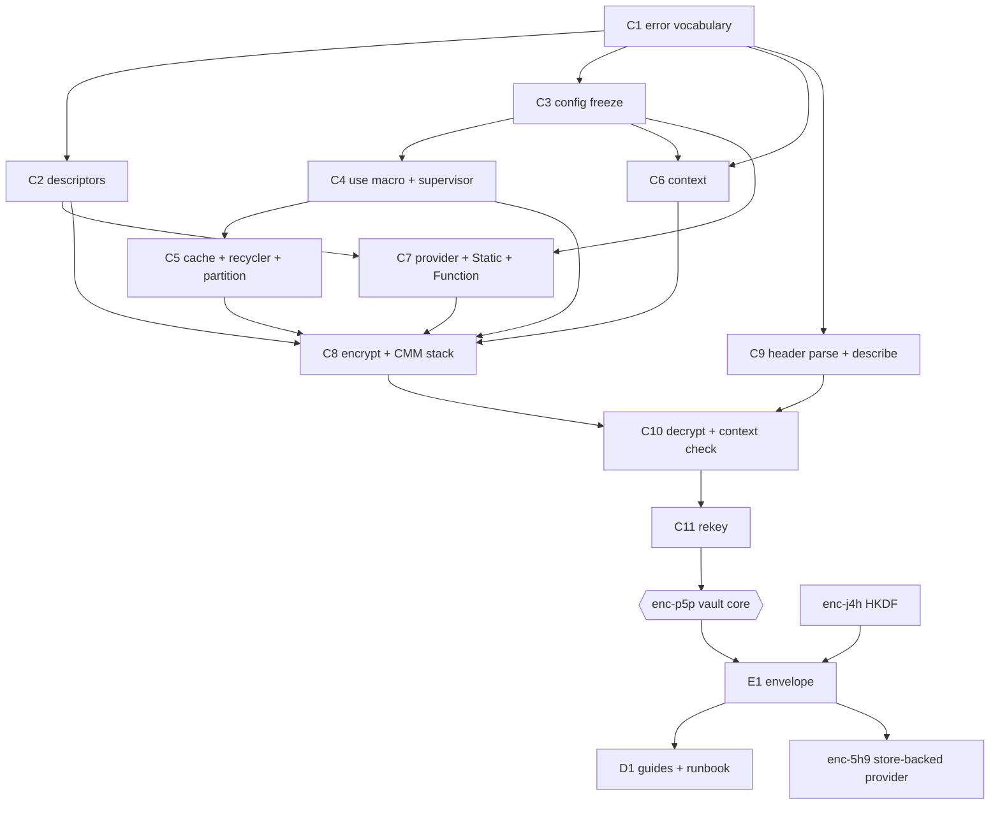

# The B3 implementation graph

Bead: enc-2y3
Date: 2026-08-27
Status: design only. No implementation lands from this document.

## What this is

ADRs 0001 through 0005 were accepted on 2026-08-27, two of them with
amendments made at acceptance. Between them they fix the vault surface, the
provider contract, the key hierarchy, the encryption context vocabulary, and
the rotation procedures. Nothing is implemented: `lib/` holds a moduledoc.

This document turns those five records into an ordered set of implementation
work items, says what each one's scope is, what it depends on, and - the part
that matters most for review - **which accepted decision each work item
discharges**. Every decision in the five records is claimed by a work item
below, or appears in "Decisions that are statements, not work items", or is
listed in "What is deliberately not in the graph". Nothing is left unaccounted
for; that completeness is the check on whether this graph is actually a plan.

The work items are filed as beads. This document is the map; the beads are
the tracker. Where they disagree, the beads win, because they are what a
worker reads.

## The five records in one line each

| ADR | Fixes | Amended at acceptance |
|---|---|---|
| 0001 | The vault: one host-owned module, one door, supervision, frozen config, bounded cache, error vocabulary | no |
| 0002 | The provider: a selector resolves to a descriptor, and only the vault builds keyrings | `Provider.Function` ships day one |
| 0003 | The envelope: a tenant key is 32 random bytes wrapped into an ordinary message | `tenant_ref/2` takes the reference subkey |
| 0004 | The context: a vault-composed, profile-enforced set of identifying keys | the context carries `tenant_ref`, not the raw identifier; `table`/`column` frozen at declaration |
| 0005 | Rotation: three independent lifecycles, four procedures, one irreversible step | no |

## The graph

`enc-p5p` ("Implement the vault core") is the epic. Eleven core work items
block it; it closes when all eleven are green. Four further items hang after
it. Every bead below is P1 unless marked.

### Core, blocking enc-p5p

| # | Bead | Work item | Depends on | Discharges |
|---|---|---|---|---|
| C1 | `enc-su9` | `Encryptor.Error` and the closed reason vocabulary | - | 0001 d10, 0002 d6, 0004 d8 |
| C2 | `enc-cgn` | Key descriptors and vault-side descriptor validation | C1 | 0002 d3, d5 (closed-set half) |
| C3 | `enc-7pd` | Config resolution and the `persistent_term` freeze | C1 | 0001 d5, d6 (config half), d8, d9; 0004 d3, amended d4 riders; 0005 d4 (`key_and_keys`) |
| C4 | `enc-1fi` | The `use` macro, supervisor, and lifecycle checks | C3 | 0001 d1, d2, d3 |
| C5 | `enc-kur` | The bounded cache: child, recycler, partition ids | C4 | 0001 d6 (recycler half), d7 |
| C6 | `enc-8eg` | `Encryptor.Context`: composition, validation, bounds | C1, C3 | 0004 d1, d2, d7, d9 |
| C7 | `enc-amv` | The provider behaviour with `Static` and `Function` | C2, C3 | 0002 d1, d2, d4, d5 (day-one row), d7; 0005 d4 |
| C8 | `enc-50m` | The encrypt path and the CMM stack ordering | C2, C4, C5, C6, C7 | 0001 d4 (encrypt); 0004 d3, amended d4, d5 |
| C9 | `enc-o1x` | Header parsing and `describe/1` | C1 | 0004 d12; 0001 oq1 as answered |
| C10 | `enc-4xj` | The decrypt path and the vault-side context check | C8, C9 | 0001 d4 (decrypt), d10; 0004 d6, d8 |
| C11 | `enc-gsd` | `rekey/2` with the context reproduced from the message | C10 | 0001 d4 (rekey), oq5 as answered; 0004 d11; 0005 d7 |

### After the core

| # | Bead | Work item | Depends on | Discharges |
|---|---|---|---|---|
| E1 | `enc-06v` | `Encryptor.Envelope`: provision, unwrap, rewrap, subkeys | `enc-p5p`, `enc-j4h` | 0003 d1-d9; 0005 d5, d10 (shipped half) |
| D1 | `enc-nsi` (P2) | The getting-started guide and the rotation runbook | E1 | 0003 d10; 0005 d1, d2, d3, d5, d8, d10 (documented half), oq5 |
| M1 | `enc-anz` (P2) | Measure the stated-but-unmeasured bounds | `enc-p5p` | 0001 oq2; 0003 oq7; 0004 oq4, oq6 |
| A1 | `enc-wpy` (P2) | ADR: telemetry and observability for the package | - | 0002 oq3 |

### Watch items, started only when upstream moves

| # | Bead | Watching | Upstream |
|---|---|---|---|
| U1 | `enc-thr` (P3) | Retire the cache recycler | aws-encryption-sdk-elixir #95 |
| U2 | `enc-h77` (P3) | Retire the vault-side reproduced-context check | aws-encryption-sdk-elixir #96 |

### Pre-existing beads this graph attaches to

| Bead | Position after this design |
|---|---|
| `enc-j4h` HKDF primitive | now also blocks E1, because `root_subkey/2` and `subkey/2` are HKDF-Expand |
| `enc-zeg` static/env provider | overlaps C7; see "Tensions" |
| `enc-5h9` DB-stored wrapped per-tenant provider | now blocked by E1; ownership tension, see "Tensions" |
| `enc-03b` AWS KMS provider (P2) | unchanged, still after `enc-p5p`; ADR-0002 d5 puts it after the envelope |
| `enc-dwd` Hex name reservation (P3) | operator-only, untouched |

### Shape

## Why this order

**The error vocabulary is first because it is the only thing every other item
matches on.** It is one closed enumeration assembled from three records, and
building it once, up front, is what stops eleven work items each inventing
their own near-miss term. It also carries the oracle rule, which is a property
of the whole package rather than of the decrypt path: writing it down first
means the decrypt path inherits it instead of rediscovering it.

**Configuration precedes everything that reads configuration.** ADR-0001
decision 5 makes config a start-time resolution frozen into `persistent_term`,
and roughly every other decision in the family is expressed as a validated
config key: the commitment policy floor, the EDK limit, the suite, the cache
bounds, the context profile, the required set, and - after the ADR-0004
amendment - the reference subkey and its known-answer check. C3 is the
largest single item in the graph for that reason, and it is worth keeping
whole: splitting the validations across items would mean the refusals land in
different beads from the shape they refuse.

**The cache lands before the encrypt path, not after it.** It is tempting to
build encrypt first and add caching as an optimization. That inverts the
security argument: the CMM stack order in ADR-0004 decision 5 is only
meaningful when there is a caching CMM in the middle of it, and the whole
point of that decision is that the wrong nesting is silently unsafe. C8 must
be able to test both arrangements from the day it exists.

**Header parsing is its own item, ahead of decrypt.** Three separate decisions
want it: `describe/1` (0004 d12), the vault-side value comparison (0004 d6),
and `rekey/2`'s reproduction of the stored context (0004 d11). ADR-0005 open
question 3 notes that three records now want one function. Building it once,
early, as a pure parse with no vault state, is what makes the other three
cheap - and it isolates the single place this package depends on the engine's
message layout, which is a dependency the family took deliberately and should
be able to point at.

**`rekey/2` is last in the core and it is small.** It is decrypt plus encrypt
plus a refusal, and it exists in the core rather than in the envelope because
`Envelope.rewrap/2` is built on it (ADR-0005 d7).

**The envelope is after the core, not inside it.** ADR-0003 decision 2 wraps a
tenant key with an ordinary vault message, so the envelope sits *above* the
vault. The arrangement looks circular and is not: the root vault's provider is
`Static` and resolves nothing from a store. That acyclicity is a constraint
worth enforcing in the envelope's own documentation - a root vault configured
with a store-backed provider would be a genuine cycle and would recurse rather
than fail cleanly.

## The seams this graph holds open

**Two upstream defects stay worked around, deliberately.** Both are open on
aws-encryption-sdk-elixir as of 2026-08-27.

- Issue #95: the local cache is unbounded, and the caching CMM calls it by
  name rather than through the cache behaviour, so the behaviour is not a
  substitution seam. C5 ships the recycler as the only bound the engine
  permits, documented as the crude mechanism it is. U1 retires it if upstream
  moves.
- Issue #96: the caching CMM serves cached decryption materials without
  calling the underlying CMM, and the reproduced-context value comparison
  lives below it, so a warm decryption cache skips the check entirely. C10
  performs the comparison itself, above the engine. U2 re-evaluates if
  upstream moves - and the likely answer is that the check stays, because this
  package has to work against v1.0.0 either way.

Neither workaround may be simplified away by an implementer who notices the
engine "already does that". The engine does it in the cold-cache case only,
and the warm case is the one that dominates real traffic.

**The boundary with `encryptor_ecto` is drawn where it already was.** This
package produces and consumes `WrappedKey` structs and never defines a table,
a migration, a repo, or a transaction (ADR-0003 d9). It walks no application
data and no function here takes a repo, a query, a batch size, or a table
(ADR-0005 d6). There is no `shred/2` and there will not be one: deleting a
wrapping is a `DELETE` against a store this package cannot see the copies of.

**The store-backed provider is downstream, and the envelope is upstream.**
ADR-0002 decision 5 places the Ecto-backed adapter in `encryptor_ecto` because
it owns a schema, a migration, and a repo. E1 is the upstream half it builds
against.

## Tensions found while drawing this graph

Recorded rather than resolved. None of these is an ADR amendment; all three
are tracker-scope questions for the operator or the 009 campaign.

1. **`enc-zeg` overlaps C7.** `enc-zeg` was filed before the ADRs were
   accepted, as "the first key-provider adapter... the reference
   implementation of the behaviour... includes the provider conformance test
   other adapters reuse". ADR-0002 decision 5 then made `Provider.Static` and
   `Provider.Function` day-one members of the vault core, which is where C7
   puts them along with the conformance suite. The residue in `enc-zeg` is the
   environment-sourcing half, which under ADR-0001 decision 5 is not a provider
   feature at all - key material arrives through the host vault's `init/1`,
   from the environment, and `Static` just holds what it was handed. On the
   present reading `enc-zeg` is either empty after C7 lands or is a docs item.
   Left open rather than re-scoped by an agent; a note is on the bead.

2. **`enc-5h9` straddles the package boundary.** It describes "the per-tenant
   provider... resolves a tenant id to a keyring by unwrapping the stored
   wrapped tenant master key... provisioning API for tenant creation", and says
   "this package defines the contract (a fetch/store callback pair), never the
   schema". The accepted records split that in two: provisioning, unwrapping
   and re-wrapping are `Encryptor.Envelope` here (E1), and the store-backed
   provider itself is `encryptor_ecto`'s (ADR-0002 d5, ADR-0003 d9). The
   dependency edge from E1 is now in place; whether `enc-5h9` should be
   narrowed to its upstream half or mirrored into the `ece-` tracker is an
   operator call.

3. **`enc-j4h` (HKDF) is dependency-free but sits behind `enc-p5p`.** It is
   `:crypto` only and needs nothing from the vault, and E1 needs it. The
   existing edge creates no cycle and no incorrect ordering, so it was left
   alone - but pulling it forward would shorten the path to the envelope by
   one item, and a 009 scheduler may want to.

4. **The ADR index was stale.** `docs/adr/README.md` listed all five records
   as `proposed` after they were accepted. The index has been brought into line
   with the status each record's own front matter already carries. No record's
   status line, decision text, or amendment was touched - acceptance is the
   operator's and stays that way.

## Decisions that are statements, not work items

Six accepted decisions are not buildable units. They are boundary statements,
naming conventions, or trust-model claims, and a bead that "implements" one
would be a bead with no diff. Each is named here so the accounting above is
complete, with the item that carries it into the world.

| Decision | What it is | Carried by |
|---|---|---|
| 0003 d10 | The blast radius table: what an attacker holding each combination can read | D1's runbook, verbatim; and the vault moduledoc |
| 0004 d10 | The division of labour with `encryptor_ecto`: that layer supplies `table` and `column` and enforces nothing | D1, and `encryptor_ecto`'s own records |
| 0005 d1 | The four-operation mapping table across both packages' vocabularies | D1's runbook. The vocabulary mismatch is the point: an operator reading a downstream runbook against this package's names can run a level 2 rotation believing it is a level 1 |
| 0005 d2 | The window between rotating and shredding exists, is unbounded above, and only an explicit shred closes it | D1, and C7's provider docs, since the mechanism is just the two resolution callbacks being independent |
| 0005 d3 | Rotation adds a name, a shred removes one, pruning is manual | C7's name obligations, plus D1 |
| 0005 d6 | The seam for a tenant rotation: mint and retire here, rewrite and verify downstream | D1, and E1's `provision/3` docs |

The reason to list them rather than fold them into a bead is that each one is
a claim someone will later want to check against the code, and a claim with no
bead is a claim nobody notices has drifted. D1 is where they land, which is
part of why D1 is not optional.

## What is deliberately not in the graph

- **Level 3 data key rotation.** It is not an operation an operator performs;
  it happens on its own on the cache bounds (ADR-0005 d1).
- **A `mix` task, a scheduler, an expiry, an automatic prune, a `shred/2`, a
  `retire/2`, a `rotate/2`.** ADR-0005 decision 10 lists these as
  not-shipped-and-deliberately. An implementation bead that adds one is a
  defect even if the code is good.
- **A streaming surface.** ADR-0001 open question 6 makes no decision, and the
  file-sized use case has not been established. It needs a record before it
  needs a bead.
- **A blind index.** ADR-0003 decision 7 reserves the label space
  (`"encryptor/v1/blind-index"`) and holds the door open for independently
  wrapped index keys; the record itself is `encryptor_ecto`'s.
- **`%Encryptor.Key.Kms{}`'s keyring mapping.** The struct is defined in C2 as
  part of the closed set; the mapping to `AwsKms.new/3` ships with `enc-03b`,
  which ADR-0002 decision 5 sequences after the envelope.
- **Anything that changes an accepted ADR.** Several open questions in the
  five records want amendments eventually (measured bounds, telemetry, a
  possible correction if the engine stops storing required keys in the
  header). Each is a bead that proposes; none is an edit.

## Documentation currency, this campaign

`README.md` is brought current with the accepted ADR surface: the status moves
from "scaffold, contracts being decided" to "design complete, implementation
not started", the five records are named and linked, the family shape
(`encryptor` plus `encryptor_ecto`) is stated, and the stale MIT line is
corrected to Apache-2.0, which is what `mix.exs` has declared since the
license adoption. No API is promised beyond what the records fix, and no code
example is shown for a function that does not exist.

The two real guides - getting started, and the rotation runbook - are D1, and
they land after the envelope, because a getting-started guide for an
unimplemented package is a promise rather than a document.
